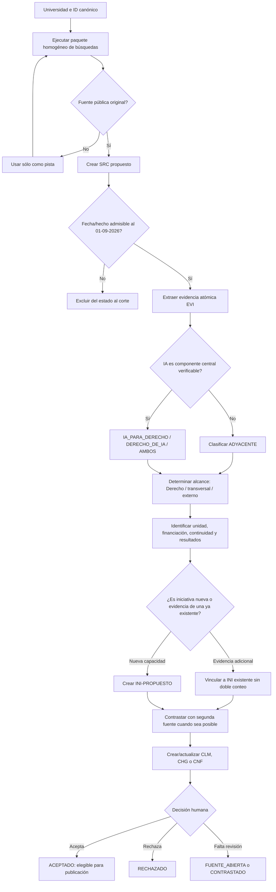
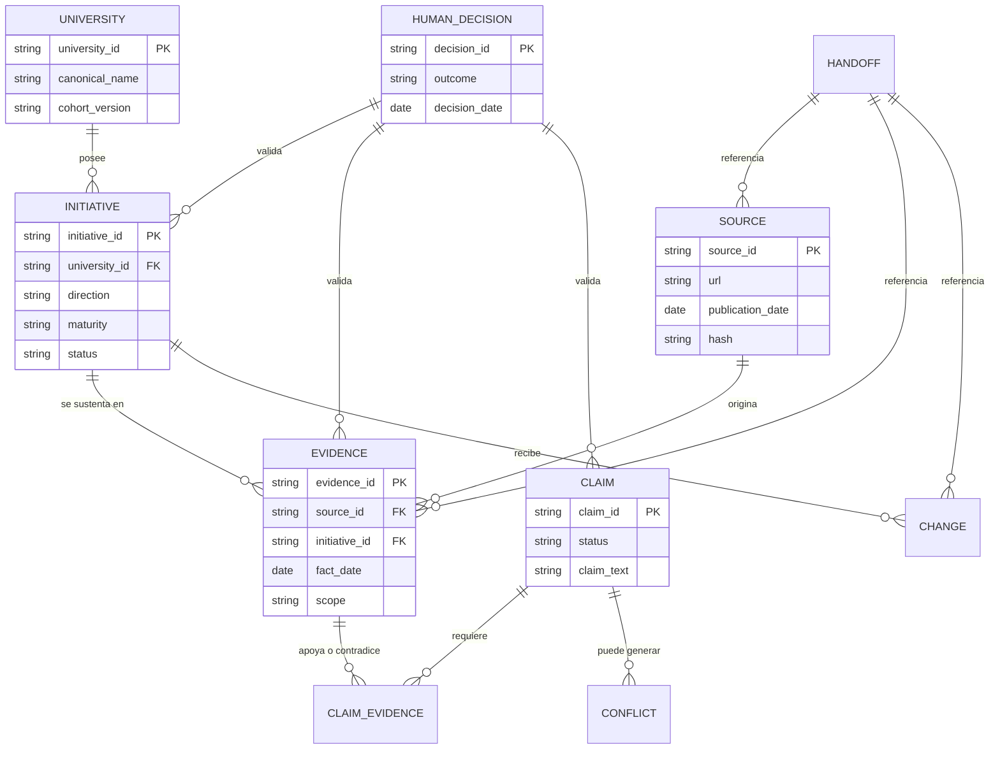
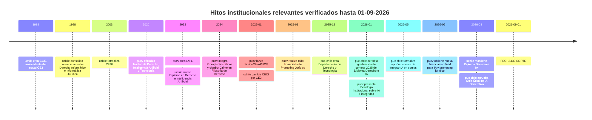

# Investigación avanzada sobre IA y Derecho en la cohorte histórica de universidades chilenas

## Resumen ejecutivo

**Proyecto:** IA y Derecho en una cohorte histórica de universidades chilenas  
**Versión de cohorte:** `COHORTE_IA_DERECHO_CHILE_11_V1`  
**Versión de protocolo:** `METODOLOGIA_IA_DERECHO_V2.0`  
**Fecha de corte:** 1 de septiembre de 2026  
**Modelo utilizado:** GPT-5.5 Thinking *(el campo venía indicado como “no especificado”; esta entrega registra el modelo efectivo de la ejecución)*  
**Fecha de ejecución:** 1 de septiembre de 2026  
**Instituciones revisadas:** las 11 instituciones canónicas para definición del universo y auditoría de la línea base; investigación sustantiva piloto en `pucv`, `puc-chile` y `uchile`.  
**Alcance temporal histórico:** sin restricción anterior a 2020 cuando la evidencia resulte pertinente para reconstruir capacidades institucionales; no se incorpora como evidencia del estado al corte ninguna publicación posterior al 1 de septiembre de 2026.  
**Estado de esta entrega:** fase de investigación y proposición de registros. **Ningún registro nuevo pasa a `ACEPTADO`**, porque no consta todavía decisión humana de validación. Por tanto, las evaluaciones que siguen son inferencias provisionales para contraste, no conclusiones publicables del informe nacional.

La auditoría del documento de 2025 muestra que es útil como **inventario histórico de pistas**, pero no puede reutilizarse como matriz probatoria ni como sistema de puntuación sin reconstrucción. El documento declara una evaluación en cinco dimensiones —pregrado, formación continua/postgrado, investigación y desarrollo, vinculación y uso interno— y asigna puntajes agregados a las once universidades, pero mezcla actividades específicamente relacionadas con IA con materias adyacentes, carece de identificadores estables fuente→evidencia→afirmación, contiene información de 2026 en una línea base presentada como 2025 y presenta inconsistencias aritméticas. Por ejemplo, en UAI los subtotales declarados suman 7,5 mientras el total consignado es 6,2; en UNAB los subtotales suman 7,75 y el documento informa 8,75; y en Universidad Central el encabezado de pregrado asigna 1 punto mientras el ítem interno vale 1,5, siendo este último el valor necesario para reproducir el total 8,5. fileciteturn0file0

La principal consecuencia metodológica es que la **línea base 2025 debe preservarse, no sobrescribirse**, mediante registros de procedencia histórica y propuestas de rectificación. Su escala 0–15 puede conservarse como una variable de legado para comparación longitudinal, pero **no debería alimentar las evaluaciones V2.0** hasta que cada componente sea revalidado y reclasificado según `IA_PARA_DERECHO`, `DERECHO_DE_IA`, `AMBOS` o `ADYACENTE`.

El piloto también cambia de manera material el cuadro preliminar de la PUCV. La evidencia oficial muestra que el actual Programa de Derecho, Inteligencia Artificial y Tecnología tiene antecedentes institucionales verificables desde **2020**, cuando se oficializó como Núcleo de Derecho, Inteligencia Artificial y Tecnología, con objetivos que incluían expresamente tanto la regulación jurídica de la IA como su uso en docencia y práctica legal. citeturn21search2 En 2024 la Escuela integró ChatGPT y un chatbot especializado en el curso de Filosofía del Derecho mediante “Prompts Socráticos”, proyecto apoyado por la Vicerrectoría Académica. citeturn18view0 En enero de 2025 lanzó ScribeClaroPUCV, asistente pensado originalmente para estudiantes de Derecho y originado en un proyecto del Programa de Desarrollo Docente de la Vicerrectoría Académica. citeturn18view1 En septiembre de 2025 DIAT y LMIL ejecutaron un taller de *prompting* jurídico financiado por los Fondos Concursables de Vinculación con el Medio 2025, con cerca de 90 participantes, y en 2026 la Facultad obtuvo nuevamente fondos competitivos para una nueva versión del taller de IA y *prompting* jurídico. citeturn18view2turn21search1

Esos antecedentes obligan a **matizar significativamente la hipótesis inicial**. La formulación “la PUCV no ha convertido sus iniciativas en una capacidad sostenida o financiada” resulta demasiado fuerte: sí existe evidencia de continuidad temporal, articulación entre DIAT y LMIL, apoyo de vicerrectorías y financiamiento competitivo. Lo que sigue sin demostrarse públicamente es algo más específico: una arquitectura de Facultad completamente transversal, con gobernanza unificada, presupuesto basal identificable, resultados de aprendizaje comunes para toda la carrera y evaluación agregada mediante indicadores de desempeño. La hipótesis revisada propuesta es:

> **`CLM-pucv-001-P — CONTRASTADO, pendiente de aceptación humana`:**  
> *Al 1 de septiembre de 2026, la PUCV dispone de una capacidad emergente y parcialmente institucionalizada en IA y Derecho —con una unidad especializada de larga data, experiencias curriculares, una herramienta orientada originalmente a estudiantes de Derecho y proyectos recurrentes financiados—. No se ha verificado todavía, en fuentes públicas, su conversión en una arquitectura transversal de Facultad con gobernanza única, presupuesto basal identificable, integración curricular sistemática y evaluación agregada mediante indicadores.*

Esta reformulación está sustentada por fuentes primarias PUCV y no por el informe anterior. citeturn21search2turn18view0turn18view1turn18view2turn21search1

En la Pontificia Universidad Católica de Chile aparece un salto estructural especialmente relevante entre finales de 2025 y 2026: la Facultad creó formalmente un **Departamento de Derecho y Tecnología** el 31 de diciembre de 2025; en mayo de 2026 informó que había oficializado en sus formularios docentes la opción de que los profesores integraran IA en sus cursos; y en agosto de 2026 aprobó una **Guía Ética para el uso de Inteligencia Artificial Generativa** aplicable a estudiantes, adoptada tras intervención de una comisión, el Comité Directivo y el Consejo de Facultad. citeturn19search2turn19search1turn19search0 Además, el Diplomado en Derecho e Inteligencia Artificial no era una mera oferta nominal: existen fuentes oficiales que acreditan graduaciones de las cohortes 2024 y 2025. citeturn20search10turn20search1 Esto obliga a corregir la duda expresada en la línea base anterior sobre su ejecución efectiva.

En la Universidad de Chile, la principal fortaleza que emerge no es la cantidad aislada de eventos, sino la **profundidad histórica de una infraestructura de derecho y tecnología**: la línea institucional se remonta al Centro de Computación e Informática Jurídica de 1988; desde 1998 se dictan cursos de Derecho Informático/Informática Jurídica; en 2003 se formalizó el CEDI; y desde el 1 de enero de 2025 la unidad pasó a denominarse CE3, con objetivos explícitos de reforzar pregrado, posgrado, líneas institucionales de investigación, internacionalización y cooperación pública y privada. citeturn22view0 Esa infraestructura es más amplia que IA y, por ello, el centro debe clasificarse como `ADYACENTE` en sí mismo; sin embargo, sobre esa base existe actividad específicamente IA, incluido un Diploma en Derecho e Inteligencia Artificial verificable desde 2022, una oferta 2026 y un proyecto de investigación 2024–2025 sobre IA, responsabilidad civil y consumo. citeturn22view1turn19search3turn20search5

El método es **escalable a las once universidades de la cohorte**, pero sólo si se reemplaza la lógica de “acumulación de actividades” por una lógica de **entidades, evidencia, alcance y continuidad**. El piloto demuestra que tres errores son especialmente fáciles de cometer: atribuir a una Facultad una política o herramienta que sólo está acreditada a nivel central de la universidad; contar múltiples eventos de un mismo programa como capacidades diferentes; y elevar ciberseguridad, protección de datos o legaltech a “IA y Derecho” cuando la IA no es central. AyudantIA UC, por ejemplo, constituye una infraestructura institucional de IA real y sofisticada, pero la fuente pública consultada no identifica despliegue específico en Derecho; por ello, no corresponde asignarla automáticamente como capacidad de la Facultad hasta verificar uso jurídico concreto. citeturn20search7

**No se extrae de este piloto ninguna conclusión sobre “Chile” ni sobre la posición general de las once universidades.** Las otras ocho instituciones quedan expresamente pendientes de la fase de escalamiento.

## Auditoría del corpus, línea base y universo canónico

El corpus efectivamente utilizable en esta ejecución contiene cuatro capas. La primera es el manifiesto y las reglas entregadas directamente por el usuario, que fijan la cohorte, el protocolo, la jerarquía de autoridad, los estados y el flujo de modificación. La segunda es el archivo “Edición 2 informe mapeo IA y Derecho en Universidades”, que se considera **antecedente histórico no verificado**. fileciteturn0file0 La tercera son las fuentes públicas originales recuperadas durante el piloto. La cuarta comprende las páginas del proyecto entregadas como arquitectura/presentación; las tres URL de Vercel no pudieron recuperarse mediante la herramienta web en esta ejecución, por lo que **no se extrajo ni integró contenido de ellas**, y en cualquier caso el usuario ha establecido que no son fuentes probatorias sobre las universidades. citeturn0view0turn0view1turn0view2

No se recibió en esta conversación una copia autónoma y verificable del archivo maestro denominado `METODOLOGIA_IA_DERECHO_V2.0`, ni los registros canónicos separados de iniciativas, fuentes, evidencias, afirmaciones, decisiones humanas y changelog. Por eso esta entrega operacionaliza **exactamente las reglas V2.0 explicitadas en el manifiesto y en la solicitud**, pero crea solamente registros propuestos. No existe base documental para presumir que los registros aquí generados han sido integrados al expediente compartido.

| Componente inicial | Auditoría | Tratamiento en esta fase |
|---|---|---|
| Manifiesto y reglas del usuario | Autoridad metodológica explícita; versiones coherentes `COHORTE_IA_DERECHO_CHILE_11_V1` / `METODOLOGIA_IA_DERECHO_V2.0` | Aplicado como norma de la ejecución |
| Informe histórico DOCX | Contiene inventario amplio y esquema de cinco dimensiones, pero mezcla datos de distintas fechas, fuentes secundarias, actividades adyacentes y puntajes con problemas de reproducibilidad. fileciteturn0file0 | `SUPERADO` **no puede decretarse todavía** sin decisión humana; se propone conservarlo como `BASELINE_2025_LEGACY` y reconstruir cada registro |
| Página del Informe 01 | Inaccesible desde la herramienta web en esta ejecución; además, por definición del usuario, es presentación, no evidencia universitaria. citeturn0view0 | No probatoria |
| Arquitectura `/investigacion` | Inaccesible en esta ejecución. citeturn0view1 | Pendiente de contraste de estructura, no de hechos universitarios |
| Informe web–PDF de referencia | Inaccesible en esta ejecución. citeturn0view2 | Pendiente sólo para diseño |
| Registros canónicos separados | No disponibles como archivos/conectores en esta ejecución | No se sobrescriben; se generan propuestas de alta y cambio |

**Reconstrucción metodológica de la línea base.** El documento histórico construyó fichas para once universidades mediante cinco dimensiones, con hasta tres puntos por dimensión y un máximo de 15; también utilizó ponderaciones por actividad entre 0,25 y 1,5. fileciteturn0file0 Para V2.0 esa estructura no debe descartarse completamente: las cinco dimensiones siguen siendo útiles como **campos descriptivos**, pero el “puntaje por actividad” no es suficientemente robusto para distinguir cantidad de eventos, institucionalización, financiación y resultados. Un seminario y una unidad orgánica permanente no deberían estar en la misma escala aditiva sin reglas de dependencia.

La reconstrucción encuentra además un problema temporal estructural. El documento presenta su metodología como revisión correspondiente a 2025, pero incluye iniciativas de 2026 e incluso actividades posteriores a fechas relevantes de corte, como programas anunciados para septiembre de 2026. fileciteturn0file0 En V2.0 cada evidencia debe tener por separado `publication_date`, `fact_start_date`, `fact_end_date`, `access_date` y `cutoff_admissibility`. De ese modo una fuente publicada en una fecha distinta del hecho no altera silenciosamente la serie longitudinal.

El universo institucional queda congelado de la siguiente manera, sin sustituciones:

| ID canónico | Institución | Alcance en esta fase |
|---|---|---|
| `puc-chile` | Pontificia Universidad Católica de Chile | Piloto sustantivo |
| `uchile` | Universidad de Chile | Piloto sustantivo |
| `udp` | Universidad Diego Portales | Cohorte definida; investigación sustantiva pendiente |
| `uandes` | Universidad de los Andes | Cohorte definida; investigación sustantiva pendiente |
| `uai` | Universidad Adolfo Ibáñez | Cohorte definida; investigación sustantiva pendiente |
| `unab` | Universidad Andrés Bello | Cohorte definida; investigación sustantiva pendiente |
| `udd` | Universidad del Desarrollo | Cohorte definida; investigación sustantiva pendiente |
| `uautonoma` | Universidad Autónoma de Chile | Cohorte definida; investigación sustantiva pendiente |
| `ucentral` | Universidad Central de Chile | Cohorte definida; investigación sustantiva pendiente |
| `pucv` | Pontificia Universidad Católica de Valparaíso | Piloto sustantivo |
| `udec` | Universidad de Concepción | Cohorte definida; investigación sustantiva pendiente |

**`CANDIDATA_FUERA_DE_COHORTE`: ninguna propuesta en esta fase piloto.** Las universidades extranjeras y otras instituciones que aparecen como colaboradoras en las fuentes no se consideran candidatas a la cohorte chilena; tampoco se realizó en esta fase un rastreo sistemático destinado a descubrir nuevas universidades chilenas fuera de la cohorte.

La condición de “cohorte cerrada” sustituye metodológicamente la justificación del documento previo, que señalaba haber seleccionado las once instituciones por relevancia empírica y disponibilidad de evidencia. fileciteturn0file0 En la nueva investigación su permanencia no depende de cuánta evidencia se encuentre: **cero resultados en una universidad también sería un resultado de búsqueda**, sujeto siempre a la cautela de que ausencia de evidencia pública no equivale a inexistencia institucional.

## Protocolo homogéneo y matriz definitiva de evidencia

El protocolo propuesto separa **descubrimiento**, **verificación**, **clasificación**, **deduplicación** y **validación**. Para cada una de las once instituciones deben ejecutarse los mismos estratos, aun cuando una búsqueda preliminar ya parezca suficiente: gobierno/unidades; pregrado; postgrado y educación continua; investigación/proyectos/repositorios; aplicaciones de IA y clínicas; vinculación/alianzas; financiamiento; y políticas o infraestructuras generales de IA de la universidad cuya aplicación específica a Derecho deba comprobarse.

Las consultas de alta recuperación deben combinar español e inglés: `"inteligencia artificial"`, `"IA generativa"`, `"artificial intelligence"`, `"machine learning"`, `LLM`, `ChatGPT`, `legaltech`, `automatización`, `"derecho y tecnología"`, `"regulación de IA"`, `"gobernanza algorítmica"` y equivalentes. “Protección de datos”, “ciberseguridad”, “derecho digital” o “innovación legal” operan como **términos de descubrimiento**, no como prueba de IA. Una iniciativa hallada sólo mediante esos términos permanece `ADYACENTE` hasta que una fuente original demuestre que la IA constituye un componente central.



La jerarquía operativa de fuentes queda así: primero documentos normativos, catálogos, páginas, repositorios y noticias oficiales de la propia Facultad; luego fuentes oficiales generales de la universidad; después registros públicos de ANID/FONDECYT/FONDEF/Mineduc y otros organismos financiadores; luego publicaciones académicas originales; y sólo después fuentes secundarias para descubrir pistas. El piloto muestra por qué es importante: la historia oficial del CE3 permite reconstruir con precisión sus cambios orgánicos desde 1988 hasta 2025, algo que una noticia periodística difícilmente preservaría con igual trazabilidad. citeturn22view0

### Madurez distinta del estado probatorio

El **estado del registro** (`PROPUESTO`, `FUENTE_ABIERTA`, etc.) no debe confundirse con el **grado de madurez institucional**. Se propone la siguiente escala independiente:

| Madurez | Regla |
|---|---|
| `M0_INDICIO` | Relación tenue o adyacente; no constituye avance específico de IA y Derecho |
| `M1_PUNTUAL` | Actividad o experimento único, sin continuidad demostrada |
| `M2_RECURRENTE` | Repetición verificable entre ciclos, versiones o años |
| `M3_INSTITUCIONALIZADA` | Programa, departamento, centro, herramienta o política con responsable institucional o mecanismo formal de apoyo |
| `M4_TRANSVERSAL` | Integra varias funciones de la Facultad y posee gobernanza/recursos sostenidos |
| `M5_EVALUADA` | Cumple M4 y publica o conserva indicadores que permiten evaluar resultados y ajustar la estrategia |

Una misma iniciativa puede ser `M3_INSTITUCIONALIZADA` y mantener estado probatorio `CONTRASTADO`; sólo la segunda dimensión decide si puede alimentar una publicación.

### Campos mínimos de la matriz

| Grupo | Campos obligatorios |
|---|---|
| Identidad | `evidence_id`, `source_id`, `initiative_id`, `claim_id`, `university_id`, `record_status`, `record_version` |
| Fuente | `source_title`, `source_type`, `publisher`, `url`, `language`, `publication_date`, `access_date`, `content_hash`, `archive_location` |
| Temporalidad | `fact_start_date`, `fact_end_date`, `cutoff_admissibility`, `post_cutoff_reconstruction`, `reconstruction_reason` |
| Contenido | `evidence_paraphrase`, `evidence_locator`, `direction`, `activity_type`, `scope` |
| Institucionalidad | `responsible_unit`, `governance_owner`, `beneficiaries`, `continuity_evidence`, `maturity` |
| Recursos | `funding_source`, `funding_instrument`, `amount_public`, `amount`, `funding_recurrence` |
| Evaluación | `evaluation_metric`, `result_metric`, `published_outcome`, `evaluation_period` |
| Calidad | `source_strength`, `independent_corroboration`, `ambiguity_note`, `negative_search_note` |
| Lineage | `confirms_id`, `contradicts_id`, `supersedes_id`, `change_rationale` |
| Validación | `reviewer`, `human_decision_id`, `decision_status`, `accepted_at` |



La reproducibilidad requiere guardar además el **log de búsqueda**, incluyendo cadena de consulta, dominio, fecha y resultado. Las búsquedas negativas deben conservarse, pero nunca transformarse por sí solas en afirmaciones del tipo “la universidad no tiene X”. La forma correcta es: “no se localizó evidencia pública de X bajo el protocolo y fuentes revisadas hasta el corte”.

## Investigación piloto: PUCV, PUC y Universidad de Chile

**Regla de lectura de las tablas:** todos los `INI-…-P` son registros **`PROPUESTO`**. “Financiamiento no determinado públicamente” significa precisamente eso; no equivale a “sin financiamiento”. La madurez es una evaluación metodológica provisional y no un estado de aceptación.

**Pontificia Universidad Católica de Valparaíso — `pucv`**

| Registro propuesto | Iniciativa | Inicio verificable | Dirección | Unidad responsable | Financiamiento verificable | Madurez propuesta | Evidencia primaria |
|---|---|---:|---|---|---|---|---|
| `INI-pucv-001-P` | Núcleo/Programa Derecho, Inteligencia Artificial y Tecnología — DIAT | **2020** | `AMBOS` | Escuela de Derecho PUCV | Presupuesto basal no determinado públicamente | `M3_INSTITUCIONALIZADA` | La fuente oficial de 2023 afirma expresamente que el Núcleo se oficializó en 2020 y define objetivos tanto regulatorios como de aplicación de IA a docencia y profesión. `[SRC-pucv-002]` https://www.pucv.cl/uuaa/derecho/noticias/nucleo-de-derecho-inteligencia-artificial-y-tecnologia-pucv-desarrolla citeturn21search2 |
| `INI-pucv-002-P` | Legal Management Innovation Lab — LMIL | 2022 | `ADYACENTE` | Facultad/Escuela de Derecho PUCV + Thomson Reuters | Colaboración PUCV–Thomson Reuters; en 2023 LMP/LMIL participaron de un FDI financiado por Mineduc | `M3_INSTITUCIONALIZADA` como innovación legal, **no como IA específica** | LMIL nace como laboratorio de transformación digital, innovación legal y gestión de proyectos. `[SRC-pucv-001]` https://www.pucv.cl/uuaa/derecho/noticias/legal-management-innovation-lab-nuevo-laboratorio-de-innovacion citeturn21search0. El FDI 2023 es oficial. `[SRC-pucv-009]` https://www.pucv.cl/uuaa/derecho/noticias/diplomado-legal-management-program-y-legal-management-innovation-lab citeturn21search4 |
| `INI-pucv-003-P` | Prompts Socráticos / chatbot “Jaime” en Filosofía del Derecho | 2024 | `IA_PARA_DERECHO` | Escuela de Derecho + DIAT | Proyecto “Innovación en la Educación”, Vicerrectoría Académica; monto no publicado | `M1_PUNTUAL` con potencial de integración curricular | La fuente describe uso de ChatGPT 3.5, *machine learning*, prompting y chatbot específico en una asignatura jurídica. `[SRC-pucv-003]` https://www.pucv.cl/uuaa/derecho-pucv/noticias/tecnologia-juridica-en-accion-programa-diat-pucv-integra-la citeturn18view0 |
| `INI-pucv-004-P` | ScribeClaroPUCV | 2025 | `IA_PARA_DERECHO` | Proyecto liderado por académica de Derecho; Programa de Desarrollo Docente/Vicerrectoría Académica | Financiamiento/apoyo interno del Programa de Desarrollo Docente; monto no publicado | `M3_INSTITUCIONALIZADA` | Herramienta web diseñada inicialmente para estudiantes de Derecho y explícitamente creada para integrar IA al servicio del aprendizaje. `[SRC-pucv-004]` https://www.pucv.cl/uuaa/derecho-pucv/noticias/scribeclaropucv-innovadora-herramienta-para-una-redaccion-juridica-clara citeturn18view1 |
| `INI-pucv-005-P` | Taller de IA Generativa / Prompting Jurídico | 2025, renovado 2026 | `AMBOS` | DIAT + LMIL; en 2026 también articulación con Ingeniería | Fondos Concursables VcM 2025 y nueva adjudicación VcM 2026; montos no publicados | `M2_RECURRENTE` y con soporte institucional | Edición 2025: tres jornadas y cerca de 90 participantes. `[SRC-pucv-005]` https://www.pucv.cl/uuaa/derecho-pucv/noticias/destacada-participacion-de-estudiantes-en-la-jornada-de-cierre-del citeturn18view2. Renovación 2026: `[SRC-pucv-006]` https://www.pucv.cl/uuaa/derecho-pucv/noticias/facultad-y-escuela-de-derecho-pucv-se-adjudican-dos-proyectos-de citeturn21search1 |
| `INI-pucv-006-P` | Decálogo PUCV sobre IA en docencia e integridad académica | 2026 | `IA_PARA_DERECHO` | Unidad de Integridad Académica / Dirección Desarrollo Docente / Vicerrectoría Académica; liderazgo de académica de Derecho | Institucional; monto no publicado | `M3_INSTITUCIONALIZADA` **a nivel universidad** | Reglas sobre uso, declaración, evaluación del proceso y protección de competencias; liderado por Claudia Poblete, académica de Derecho. `[SRC-pucv-007]` https://www.pucv.cl/pucv/noticias/destacadas/universidad-presento-decalogo-para-el-uso-etico-de-la-inteligencia citeturn18view4 |

Dos correcciones son particularmente relevantes para la línea base PUCV. Primero, el DIAT **no es simplemente una creación reciente de 2025**: una fuente oficial fechada en 2023 señala que la iniciativa fue oficializada en 2020. citeturn21search2 Segundo, el valor histórico “Uso interno IA: 0” ya no es sostenible como afirmación literal respecto del estado 2025: Prompts Socráticos había integrado IA en una asignatura jurídica desde 2024, y ScribeClaro fue anunciado en enero de 2025 como herramienta originalmente destinada a estudiantes de Derecho. citeturn18view0turn18view1 El cambio debe registrarse, no sobrescribir el dato antiguo.

También debe corregirse una inferencia opuesta: **LMIL no debe contarse por defecto como iniciativa específica de IA**. Su fuente fundacional se refiere a transformación digital, legal management e innovación jurídica, sin hacer de la IA su objeto central; es, por tanto, `ADYACENTE`. citeturn21search0 Que proyectos presentados a Innova Day utilicen IA demuestra capacidad de convocatoria hacia el ecosistema tecnológico, no convierte automáticamente todo el laboratorio en una iniciativa de IA. En 2022, por ejemplo, uno de los proyectos ganadores sí empleaba IA para automatizar documentos, pero era un proyecto presentado al concurso, no una plataforma institucional propia de PUCV. citeturn21search5

**Pontificia Universidad Católica de Chile — `puc-chile`**

| Registro propuesto | Iniciativa | Inicio verificable | Dirección | Unidad responsable | Financiamiento verificable | Madurez propuesta | Evidencia primaria |
|---|---|---:|---|---|---|---|---|
| `INI-puc-chile-001-P` | Programa de Derecho, Ciencia y Tecnología UC | Activo antes de 2025; inicio exacto pendiente | `ADYACENTE` como estructura matriz, con iniciativas IA específicas | Facultad de Derecho UC | No determinado en fuentes revisadas | `M3_INSTITUCIONALIZADA` | Sitio oficial mantiene Diplomado y Curso en Derecho e IA, junto con otras líneas tecnológicas. `[SRC-puc-chile-001]` https://derechocienciaytecnologia.uc.cl/ citeturn20search9 |
| `INI-puc-chile-002-P` | Diplomado en Derecho e Inteligencia Artificial | ≤2024; cohortes 2024 y 2025 verificadas | `AMBOS` | Programa Derecho, Ciencia y Tecnología / Educación Continua Derecho UC | Arancel/educación continua; estructura presupuestaria no publicada | `M2_RECURRENTE` → candidato a `M3` | Graduación 2024 y 2025 acreditan ejecución efectiva. `[SRC-puc-chile-002A]` https://derechocienciaytecnologia.uc.cl/2025/01/08/graduacion-de-la-generacion-2024-de-los-diplomados-del-programa-de-derecho-ciencia-y-tecnologia-uc/ citeturn20search10; `[SRC-puc-chile-002B]` https://derechocienciaytecnologia.uc.cl/2026/01/16/graduacion-de-la-generacion-2025-de-los-diplomados-del-programa-de-derecho-ciencia-y-tecnologia-uc/ citeturn20search1 |
| `INI-puc-chile-003-P` | Departamento de Derecho y Tecnología | 2025 | `ADYACENTE` como unidad orgánica, con mandato que incluye IA | Facultad de Derecho UC | Unidad orgánica; presupuesto específico no publicado | `M3_INSTITUCIONALIZADA` | Creación formal anunciada el 31-12-2025, dirigida por Raúl Madrid. `[SRC-puc-chile-003]` https://derecho.uc.cl/derecho-uc-formaliza-la-creacion-del-primer-departamento-de-derecho-y-tecnologia-en-chile/ citeturn19search2 |
| `INI-puc-chile-004-P` | Incorporación declarable de IA en condiciones/evaluaciones de cursos | 2026 | `IA_PARA_DERECHO` | Facultad/Escuela de Derecho UC | Institucional; no se identifica monto | `M2_RECURRENTE` si se acredita adopción por cursos; por ahora mecanismo formal | En mayo de 2026 el decano informó la oficialización en el formulario de condiciones y evaluaciones de la opción para profesores de integrar IA. `[SRC-puc-chile-004]` https://derecho.uc.cl/derecho-uc-inaugura-ano-academico-2026-con-foco-en-excelencia-innovacion-y-proyeccion-internacional/ citeturn19search1 |
| `INI-puc-chile-005-P` | Guía Ética para uso de IA Generativa | 2026 | `IA_PARA_DERECHO` | Facultad de Derecho; comisión interdisciplinaria interna, Comité Directivo y Consejo de Facultad | Institucional | `M3_INSTITUCIONALIZADA` | Aprobada y publicada 21-08-2026; regula autonomía docente, transparencia, conservación de registros, infracciones y verificación oral. `[SRC-puc-chile-005]` https://derecho.uc.cl/facultad-de-derecho-uc-establece-guia-etica-para-uso-de-inteligencia-artificial-generativa/ citeturn19search0 |
| `INI-puc-chile-006-P` | AyudantIA UC | 2025/2026 en despliegue institucional | `IA_PARA_DERECHO` **sólo potencialmente respecto de Derecho** | Nivel central UC | Institucional UC | `M4_TRANSVERSAL` en la universidad; **N/D para Derecho** | Permite crear agentes de IA generativa por curso e integrarlos con plataformas UC. La fuente no identifica Facultad de Derecho ni cursos jurídicos. `[SRC-puc-chile-006]` https://docencia.ia.uc.cl/ayudantia/ citeturn20search7 |

La evidencia de `puc-chile` corrige dos aspectos de la línea base. El primero es positivo: el informe anterior señalaba dudas sobre si el Diplomado de Derecho e IA se había realizado; las ceremonias oficiales de graduación de generaciones 2024 y 2025 eliminan esa incertidumbre. citeturn20search10turn20search1 El segundo es restrictivo: no es metodológicamente válido atribuir a la Facultad de Derecho toda la madurez de AyudantIA sólo porque el sistema está disponible en la UC. La fuente oficial describe una plataforma institucional accesible a docentes y estudiantes, pero no ofrece, en lo recuperado, un desglose que pruebe adopción concreta en Derecho. citeturn20search7

El hecho estructural más importante al corte es la secuencia diciembre 2025–agosto 2026: creación del Departamento de Derecho y Tecnología, formalización de la opción docente de integrar IA y aprobación de una guía específica de Facultad. citeturn19search2turn19search1turn19search0 Esta combinación es cualitativamente distinta de una colección de seminarios: hay **estructura orgánica + mecanismo docente + regla de gobernanza**. Aun así, “Departamento de Derecho y Tecnología” debe permanecer `ADYACENTE` como entidad matriz; sólo sus actuaciones cuyo objeto central sea IA pasan a categorías A–C.

**Universidad de Chile — `uchile`**

| Registro propuesto | Iniciativa | Inicio verificable | Dirección | Unidad responsable | Financiamiento verificable | Madurez propuesta | Evidencia primaria |
|---|---|---:|---|---|---|---|---|
| `INI-uchile-001-P` | CCIJ → CIJ → CEDI → CE3 | 1988; nombre CE3 desde 1-01-2025 | `ADYACENTE` como infraestructura derecho-tecnología | Facultad de Derecho UChile | MECESUP histórico para docencia/infraestructura; otros recursos no reconstruidos aquí | `M4_TRANSVERSAL` en derecho y tecnología; IA específica se evalúa aparte | Historia institucional oficial documenta cambios orgánicos, docencia, posgrados y objetivos 2025. `[SRC-uchile-001]` https://derecho.uchile.cl/centro-estudios-derecho-tecnologia-sociedad/quienes-somos/historia citeturn22view0 |
| `INI-uchile-002-P` | Diploma en Derecho e Inteligencia Artificial | 2022 | `AMBOS` | entonces CEDI; actualmente CE3 | Arancel 60 UF en edición 2022; autofinanciamiento exacto no inferido | `M3_INSTITUCIONALIZADA` por recurrencia y unidad especializada | Programa 2022 incluye fundamentos de IA, regulación, ética, PI, responsabilidad, justicia, transparencia y derechos fundamentales. `[SRC-uchile-002]` https://postgrados.derecho.uchile.cl/diploma-en-derecho-e-inteligencia-artificial/ citeturn22view1 |
| `INI-uchile-003-P` | Edición 2026 del Diploma Derecho e IA | 2026 | `AMBOS` | CE3 | No determinado más allá del esquema de postgrado | Evidencia de continuidad de `INI-uchile-002-P`, **no iniciativa nueva para conteo** | Página oficial del segundo semestre 2026 identifica al CE3 como unidad académica. `[SRC-uchile-003]` https://postgrados.derecho.uchile.cl/diploma-derecho-e-inteligencia-artificial/ citeturn19search3 |
| `INI-uchile-004-P` | Proyecto “Problemas y desafíos que plantea la IA…” en responsabilidad civil y consumo | 2024–2025 | `DERECHO_DE_IA` | Departamento de Derecho Privado, con Programa Derecho del Consumo y colaboración internacional | Proyecto de Internacionalización adjudicado por el Departamento; monto no localizado | `M2_RECURRENTE` / investigación con varias salidas | Fuente oficial identifica proyecto y seminario enero 2025; una segunda noticia confirma que el proyecto de internacionalización fue adjudicado al Departamento. `[SRC-uchile-004]` https://derecho.uchile.cl/noticias/225314/de-quien-es-la-responsabilidad-civil-cuando-falla-la-ia citeturn20search5 |
| `INI-uchile-005-P` | Línea/repertorio de tesis sobre IA | Evidencia histórica desde 2008; tesis recientes 2023 y 2025 | `AMBOS` a nivel de conjunto | CE3/Facultad de Derecho | No aplica como programa financiado autónomo | `M2_RECURRENTE` como evidencia de formación/investigación, no centro independiente | Repositorio oficial lista tesis sobre IA judicial, PI, transparencia algorítmica y derecho desde 2008 a 2025. `[SRC-uchile-005]` https://derecho.uchile.cl/centro-estudios-derecho-tecnologia-sociedad/publicaciones/tesis/tesis-en-inteligencia-artificial citeturn20search3 |

La historia del CE3 permite hacer una distinción crítica. UChile posee una infraestructura duradera de **derecho y tecnología**, pero no toda esa historia es historia de IA. El propio centro pasó por informática jurídica, derecho informático, nuevas tecnologías, ciberseguridad y protección de datos antes de que la IA adquiriera su peso actual. citeturn22view0 Por eso la antigüedad de 1988 no puede utilizarse para afirmar que UChile lleva cuatro décadas institucionalizando “IA y Derecho”; sí demuestra, en cambio, que la IA actual se inserta en una infraestructura organizacional preexistente.

La oferta de IA es más directamente verificable desde 2022. El Diploma de ese año incluía contenidos técnicos y regulatorios, así como IA en justicia, responsabilidad, propiedad intelectual, derechos fundamentales y transparencia algorítmica; el programa aparece nuevamente en la oferta del segundo semestre de 2026. citeturn22view1turn19search3 Además, la noticia institucional que resume 2025 informa que los académicos del CE3 impartieron más de veinte cursos de pre y postgrado durante ese año y que la regulación de IA formó parte de la oferta, aunque esas cifras son auto-reportadas por la propia universidad y deben conservar esa atribución. citeturn22view2

En investigación, el proyecto sobre responsabilidad civil y consumo no debe fragmentarse artificialmente en un seminario, un congreso, un *workshop* y varias noticias como si fueran cuatro capacidades. Las actividades de enero, mayo y agosto de 2025 aparecen vinculadas al mismo proyecto, de modo que deben registrarse como **múltiples evidencias de continuidad de una iniciativa**. citeturn20search0turn20search2turn20search6 Esa regla de deduplicación es uno de los resultados más importantes del piloto.

No se localizó durante esta fase una fuente pública que demuestre una herramienta o política **específica de la Facultad de Derecho UChile** para uso interno de IA equivalente a la Guía Ética de Derecho UC o a ScribeClaroPUCV. Esto no autoriza a afirmar “Uso interno de IA = 0”: el enunciado metodológicamente correcto es **“despliegue interno específico de Derecho no acreditado en el corpus piloto”**.

El siguiente timeline reúne hitos **verificados**, no todos los eventos encontrados:



Los hitos de la línea temporal proceden de registros institucionales oficiales de las tres universidades. citeturn22view0turn21search2turn21search0turn22view1turn18view0turn18view1turn18view2turn19search2turn20search1turn18view4turn19search1turn21search1turn19search3turn19search0

**Contraste de la hipótesis PUCV.** La evidencia no permite aceptarla literalmente ni rechazarla por completo:

| Componente de la hipótesis | Resultado piloto | Trazabilidad |
|---|---|---|
| “dispone de iniciativas relevantes” | **Confirmado provisionalmente** | DIAT desde 2020, Prompts Socráticos, ScribeClaro, taller IA/prompting. citeturn21search2turn18view0turn18view1turn18view2 |
| “no coherente” | **Matizado** | DIAT y LMIL aparecen colaborando recurrentemente y la Escuela articula docencia, herramienta y VcM; aún falta una gobernanza única públicamente verificable. citeturn18view2turn21search1 |
| “no transversal” | **Parcialmente apoyado** | Hay actividad en docencia, herramientas y VcM, pero no se localizó un itinerario curricular obligatorio/faculty-wide de IA. El Decálogo es transversal a nivel PUCV, no prueba por sí solo transversalidad específica de Derecho. citeturn18view4 |
| “no sostenida” | **Refutada en su formulación absoluta** | DIAT tiene continuidad 2020–2026; el taller se financió y repitió entre 2025 y 2026. citeturn21search2turn18view2turn21search1 |
| “no financiada” | **Refutada en su formulación absoluta** | Hay apoyo Vicerrectoría Académica, Programa de Desarrollo Docente y fondos VcM 2025/2026; LMIL/LMP participaron además en proyecto FDI financiado por Mineduc. Esto no prueba presupuesto basal DIAT. citeturn18view0turn18view1turn18view2turn21search1turn21search4 |
| “no evaluable” | **Apoyado parcialmente** | Se publican datos de participación en algunas acciones, pero no se localizaron KPIs agregados del portafolio IA-Derecho, evaluación longitudinal de aprendizaje o cuadro público de resultados. citeturn18view2 |

Por ello, **la preocupación estratégica por insuficiencia no desaparece, pero cambia de objeto**: el problema verificable ya no es la falta de actividad, continuidad o cualquier financiamiento; es la falta —hasta donde alcanza el corpus público— de una capa superior que convierta actividades parcialmente institucionalizadas en una política de Facultad gobernada, presupuestada basalmente y evaluada como cartera.

## Escalabilidad y decisiones accionables

El protocolo puede escalar a `COHORTE_IA_DERECHO_CHILE_11_V1`. El mínimo mecánico consiste en ocho estratos de búsqueda por once instituciones, es decir, **88 paquetes base de búsqueda**, antes de aperturas de fuentes, seguimiento de enlaces y contrastes. La carga no es problemática por su tamaño; el riesgo está en la consistencia de clasificación.

El piloto revela seis controles que deberían ser obligatorios al escalar:

| Control | Riesgo que evita |
|---|---|
| Separar `scope=FACULTAD_DERECHO` de `scope=UNIVERSIDAD` | Atribuir a Derecho herramientas centrales cuya adopción local no está probada, como puede ocurrir con AyudantIA UC. citeturn20search7 |
| Deduplicar por iniciativa | Contar seminario + congreso + workshop de un mismo proyecto como tres capacidades distintas; UChile muestra claramente este caso. citeturn20search0turn20search2turn20search6 |
| Mantener `ADYACENTE` como categoría real y no residual | Inflar IA con centros amplios de derecho y tecnología, LMIL, protección de datos o ciberseguridad. citeturn21search0turn22view0 |
| Distinguir financiación competitiva de presupuesto basal | No confundir una adjudicación anual VcM con capacidad presupuestaria permanente. citeturn21search1 |
| Registrar cambio de nombres/unidades | Evitar duplicar CEDI y CE3 como instituciones diferentes. citeturn22view0 |
| Formular negativamente sólo el resultado de búsqueda | “No se encontró evidencia pública” es reproducible; “no existe” raramente lo es |

Para la PUCV, la investigación piloto ya permite identificar decisiones accionables **sin predeterminar el informe final**. La primera es crear un **mapa de cartera único** que conecte formalmente DIAT, LMIL, ScribeClaro, proyectos de innovación docente y proyectos VcM, distinguiendo qué pertenece realmente a IA y Derecho de la innovación legal adyacente. Esa medida se justifica porque hoy las fuentes muestran colaboración efectiva, pero distribuida entre estructuras y mecanismos diferentes. citeturn21search2turn21search0turn18view1turn21search1

La segunda es convertir el avance curricular puntual en **competencias verificables de egreso**. Prompts Socráticos demuestra que es posible utilizar IA directamente en razonamiento y argumentación jurídica; el siguiente paso institucional no tiene que ser necesariamente una nueva asignatura aislada, sino definir qué debería saber todo egresado respecto de uso de IA, verificación, trazabilidad, confidencialidad, *prompting*, automatización, sesgos y marco jurídico. citeturn18view0 Esto permitiría separar claramente los dos ejes del protocolo: saber **usar IA en el Derecho** y saber **gobernar jurídicamente la IA**.

La tercera es establecer un **presupuesto y responsable de cartera**, diferenciando recursos basales de fondos concursables. La PUCV ya ha demostrado capacidad de obtener apoyo de la Vicerrectoría Académica y fondos VcM, incluido financiamiento repetido para talleres. citeturn18view0turn18view2turn21search1 El indicador estratégico que falta no es “obtuvo o no fondos”, sino cuánto del funcionamiento de IA y Derecho depende de convocatorias anuales y cuánto está cubierto por una asignación estable.

La cuarta es elevar la evaluación a `M5_EVALUADA`. Como mínimo, un tablero anual de Facultad debería distinguir: número y proporción de cursos con actividades IA; estudiantes cubiertos; docentes capacitados; usuarios activos de herramientas; resultados de aprendizaje pre/post; incidencias de integridad; proyectos de investigación y financiación competitiva; publicaciones; proyectos transferidos al sector jurídico; continuidad anual; y satisfacción de usuarios. En el corpus público actual se observan cifras puntuales —por ejemplo cerca de 90 participantes en el taller 2025— pero no una evaluación agregada del portafolio. citeturn18view2

La quinta es evitar una carrera puramente cuantitativa frente a PUC y UChile. El piloto sugiere **modelos institucionales distintos**, no un ranking todavía aceptable: PUC presenta hacia el corte una nueva combinación de departamento, reglas docentes y guía ética específica de Facultad; UChile cuenta con una infraestructura histórica de derecho y tecnología y una trayectoria de programas especializados; PUCV exhibe una combinación interesante de uso curricular experimental, herramienta aplicada y vinculación financiada. citeturn19search2turn19search1turn19search0turn22view0turn22view1turn18view0turn18view1 La pregunta estratégica para PUCV, por tanto, no debe ser simplemente “cuántas actividades faltan”, sino **qué modelo de capacidad quiere institucionalizar y cómo demostrará sus resultados**.

Esta evaluación de escalabilidad **no autoriza a extrapolar** que las otras ocho universidades carezcan o dispongan de determinadas capacidades. Deben ser investigadas con exactamente el mismo protocolo.

## Registro trazable de fuentes, cambios, pendientes y HANDOFF

### Fuentes nuevas del piloto

Las siguientes fuentes son propuestas para incorporación al `registro_de_fuentes`. Todas fueron publicadas al corte o reconstruyen hechos anteriores mediante una fuente también disponible al corte; ninguna publicación posterior al 1 de septiembre de 2026 se utiliza aquí.

| ID propuesto | Universidad | Fuente original y URL | Uso principal | Estado propuesto |
|---|---|---|---|---|
| `SRC-pucv-001` | `pucv` | PUCV, LMIL, 06-01-2022 — https://www.pucv.cl/uuaa/derecho/noticias/legal-management-innovation-lab-nuevo-laboratorio-de-innovacion citeturn21search0 | Origen y naturaleza adyacente de LMIL | `FUENTE_ABIERTA` |
| `SRC-pucv-002` | `pucv` | PUCV, Núcleo DIAT, 20-11-2023 — https://www.pucv.cl/uuaa/derecho/noticias/nucleo-de-derecho-inteligencia-artificial-y-tecnologia-pucv-desarrolla citeturn21search2 | Oficialización 2020, misión y actividades | `FUENTE_ABIERTA` |
| `SRC-pucv-003` | `pucv` | PUCV, Prompts Socráticos, 24-04-2024 — https://www.pucv.cl/uuaa/derecho-pucv/noticias/tecnologia-juridica-en-accion-programa-diat-pucv-integra-la citeturn18view0 | IA aplicada en curso jurídico | `FUENTE_ABIERTA` |
| `SRC-pucv-004` | `pucv` | PUCV, ScribeClaro, 30-01-2025 — https://www.pucv.cl/uuaa/derecho-pucv/noticias/scribeclaropucv-innovadora-herramienta-para-una-redaccion-juridica-clara citeturn18view1 | Herramienta IA originalmente para Derecho | `FUENTE_ABIERTA` |
| `SRC-pucv-005` | `pucv` | PUCV, Taller Prompting, 07-10-2025 — https://www.pucv.cl/uuaa/derecho-pucv/noticias/destacada-participacion-de-estudiantes-en-la-jornada-de-cierre-del citeturn18view2 | Edición 2025, contenido, beneficiarios y VcM | `FUENTE_ABIERTA` |
| `SRC-pucv-006` | `pucv` | PUCV, adjudicación VcM, 03-06-2026 — https://www.pucv.cl/uuaa/derecho-pucv/noticias/facultad-y-escuela-de-derecho-pucv-se-adjudican-dos-proyectos-de citeturn21search1 | Renovación/fondos 2026 | `FUENTE_ABIERTA` |
| `SRC-pucv-007` | `pucv` | PUCV, Día de la IA/Decálogo, 09-01-2026 — https://www.pucv.cl/pucv/noticias/destacadas/universidad-presento-decalogo-para-el-uso-etico-de-la-inteligencia citeturn18view4 | Gobernanza universitaria de IA y vínculo con Derecho | `FUENTE_ABIERTA` |
| `SRC-pucv-009` | `pucv` | PUCV, FDI Mineduc, 18-04-2023 — https://www.pucv.cl/uuaa/derecho/noticias/diplomado-legal-management-program-y-legal-management-innovation-lab citeturn21search4 | Financiamiento de componente adyacente | `FUENTE_ABIERTA` |
| `SRC-puc-chile-001` | `puc-chile` | Programa Derecho, Ciencia y Tecnología UC — https://derechocienciaytecnologia.uc.cl/ citeturn20search9 | Estructura y oferta | `FUENTE_ABIERTA` |
| `SRC-puc-chile-002A` | `puc-chile` | Graduación 2024 — https://derechocienciaytecnologia.uc.cl/2025/01/08/graduacion-de-la-generacion-2024-de-los-diplomados-del-programa-de-derecho-ciencia-y-tecnologia-uc/ citeturn20search10 | Ejecución efectiva Diploma IA | `FUENTE_ABIERTA` |
| `SRC-puc-chile-002B` | `puc-chile` | Graduación generación 2025 — https://derechocienciaytecnologia.uc.cl/2026/01/16/graduacion-de-la-generacion-2025-de-los-diplomados-del-programa-de-derecho-ciencia-y-tecnologia-uc/ citeturn20search1 | Continuidad efectiva | `FUENTE_ABIERTA` |
| `SRC-puc-chile-003` | `puc-chile` | Departamento Derecho y Tecnología, 31-12-2025 — https://derecho.uc.cl/derecho-uc-formaliza-la-creacion-del-primer-departamento-de-derecho-y-tecnologia-en-chile/ citeturn19search2 | Cambio orgánico | `FUENTE_ABIERTA` |
| `SRC-puc-chile-004` | `puc-chile` | Año académico, 14-05-2026 — https://derecho.uc.cl/derecho-uc-inaugura-ano-academico-2026-con-foco-en-excelencia-innovacion-y-proyeccion-internacional/ citeturn19search1 | Integración docente/formularios y estrategia | `FUENTE_ABIERTA` |
| `SRC-puc-chile-005` | `puc-chile` | Guía ética IA, 21-08-2026 — https://derecho.uc.cl/facultad-de-derecho-uc-establece-guia-etica-para-uso-de-inteligencia-artificial-generativa/ citeturn19search0 | Gobernanza específica de Facultad | `FUENTE_ABIERTA` |
| `SRC-puc-chile-006` | `puc-chile` | AyudantIA UC — https://docencia.ia.uc.cl/ayudantia/ citeturn20search7 | Infraestructura central; alcance Derecho pendiente | `FUENTE_ABIERTA` |
| `SRC-puc-chile-007` | `puc-chile` | Seminario Prácticas del Derecho e IA, 03-04-2025 — https://derechocienciaytecnologia.uc.cl/2025/04/03/seminario-analiza-el-impacto-juridico-de-la-inteligencia-artificial-en-chile-mexico-y-ee-uu/ citeturn20search13 | VcM IA específica | `FUENTE_ABIERTA` |
| `SRC-uchile-001` | `uchile` | Historia CE3 — https://derecho.uchile.cl/centro-estudios-derecho-tecnologia-sociedad/quienes-somos/historia citeturn22view0 | Genealogía 1988–2025 | `FUENTE_ABIERTA` |
| `SRC-uchile-002` | `uchile` | Diploma Derecho e IA 2022 — https://postgrados.derecho.uchile.cl/diploma-en-derecho-e-inteligencia-artificial/ citeturn22view1 | Formación IA específica | `FUENTE_ABIERTA` |
| `SRC-uchile-003` | `uchile` | Diploma segundo semestre 2026 — https://postgrados.derecho.uchile.cl/diploma-derecho-e-inteligencia-artificial/ citeturn19search3 | Continuidad de oferta | `FUENTE_ABIERTA` |
| `SRC-uchile-004` | `uchile` | Proyecto IA/responsabilidad/consumo — https://derecho.uchile.cl/noticias/225314/de-quien-es-la-responsabilidad-civil-cuando-falla-la-ia citeturn20search5 | Proyecto de investigación/internacionalización | `FUENTE_ABIERTA` |
| `SRC-uchile-005` | `uchile` | Tesis en IA — https://derecho.uchile.cl/centro-estudios-derecho-tecnologia-sociedad/publicaciones/tesis/tesis-en-inteligencia-artificial citeturn20search3 | Producción formativa/investigación | `FUENTE_ABIERTA` |
| `SRC-uchile-006` | `uchile` | Balance CE3 2025, publicado 08-01-2026 — https://derecho.uchile.cl/noticias/236453/ce3-consolida-liderazgo-en-el-pais-y-en-latinoamerica citeturn22view2 | Reconstruye actividad 2025 desde fuente posterior pero anterior al corte | `FUENTE_ABIERTA` |
| `SRC-uchile-007` | `uchile` | Congreso IA Derecho Privado, 09-06-2025 — https://derecho.uchile.cl/noticias/228982/congreso-internacional-aborda-desafios-de-la-ia-en-el-derecho-privado citeturn20search2 | Corrobora continuidad de proyecto | `FUENTE_ABIERTA` |
| `SRC-uchile-008` | `uchile` | Workshop IA y Derecho Privado, 29-08-2025 — https://derecho.uchile.cl/agenda/231464/workshop-ia-y-derecho-privado-casos-practicos citeturn20search6 | Corrobora continuidad de proyecto | `FUENTE_ABIERTA` |

La fuente `SRC-uchile-006` es un ejemplo legítimo de **reconstrucción retrospectiva**: fue publicada el 8 de enero de 2026, antes de la fecha de corte, y describe explícitamente actividad realizada durante 2025; por tanto puede probar un hecho de 2025, pero la matriz debe conservar separadas `publication_date=2026-01-08` y `fact_period=2025`. citeturn22view2

### Evidencias nuevas y afirmaciones afectadas

| Evidencia | Hecho atómico | Registros/afirmaciones afectados | Estado |
|---|---|---|---|
| `EVI-pucv-001` | DIAT/Núcleo fue oficializado en 2020 con misión explícita `AMBOS` | `INI-pucv-001-P`; corrige cronología base | `CONTRASTADO` por continuidad posterior |
| `EVI-pucv-002` | IA se integró en Filosofía del Derecho en 2024 mediante Prompts Socráticos/ChatGPT/chatbot | `CLM-pucv-002-P`; contradice lectura “uso interno=0” | `FUENTE_ABIERTA` |
| `EVI-pucv-003` | ScribeClaro fue diseñado inicialmente para estudiantes de Derecho y surgió de programa institucional docente | `CLM-pucv-002-P`; `INI-pucv-004-P` | `FUENTE_ABIERTA` |
| `EVI-pucv-004` | Taller de prompting jurídico recibió Fondo VcM 2025 | `CLM-pucv-003-P` | `FUENTE_ABIERTA` |
| `EVI-pucv-005` | Nueva versión obtuvo Fondo VcM 2026 | continuidad de `INI-pucv-005-P`; `CLM-pucv-003-P` | `CONTRASTADO` junto con EVI-pucv-004 |
| `EVI-pucv-006` | PUCV adoptó Decálogo institucional de IA, liderado por académica de Derecho | contexto de gobernanza; no prueba implementación faculty-wide por sí solo | `FUENTE_ABIERTA` |
| `EVI-puc-chile-001` | Diploma IA graduó cohortes 2024 y 2025 | contradice duda de ejecución en base histórica | `CONTRASTADO` |
| `EVI-puc-chile-002` | Se crea Departamento de Derecho y Tecnología 31-12-2025 | nueva capacidad orgánica | `FUENTE_ABIERTA` |
| `EVI-puc-chile-003` | Facultad formaliza opción docente para integrar IA en cursos | integración curricular/gobernanza | `FUENTE_ABIERTA` |
| `EVI-puc-chile-004` | Facultad aprueba Guía Ética IA 21-08-2026 | nueva política interna | `FUENTE_ABIERTA` |
| `EVI-puc-chile-005` | AyudantIA existe institucionalmente, pero fuente no identifica uso jurídico | obliga a separar alcance Universidad/Derecho | `FUENTE_ABIERTA` |
| `EVI-uchile-001` | CE3 tiene genealogía institucional desde 1988 y nombre actual desde 2025 | reconstruye línea base organizacional | `FUENTE_ABIERTA` |
| `EVI-uchile-002` | Diploma de Derecho e IA existe desde 2022 | confirma continuidad histórica específica en IA | `CONTRASTADO` con edición 2026 |
| `EVI-uchile-003` | Proyecto 2024–2025 aborda IA, responsabilidad civil y consumo | nueva iniciativa `DERECHO_DE_IA` | `CONTRASTADO` |
| `EVI-uchile-004` | Seminario, congreso y workshop pertenecen al mismo proyecto | evita triple conteo | `CONTRASTADO` |
| `EVI-uchile-005` | Repositorio contiene tesis IA 2008, 2023 y 2025 | evidencia continuidad formativa/investigativa | `FUENTE_ABIERTA` |

### Cambios propuestos y contradicciones

| ID | Tipo | Propuesta | Registro anterior afectado | Justificación |
|---|---|---|---|---|
| `CNF-BASE-001-P` | Conflicto metodológico | Separar estrictamente línea base 2025 de hechos 2026 | metodología DOCX | El documento mezcla años dentro de una evaluación presentada como 2025. fileciteturn0file0 |
| `CNF-BASE-002-P` | Conflicto aritmético | No reutilizar totales sin recomputación | UAI, UNAB, UCentral y potencialmente otros | Inconsistencias internas de suma/subtotales. fileciteturn0file0 |
| `CNF-BASE-003-P` | Conflicto conceptual | Reclasificar IA específica vs `ADYACENTE` | Todas las fichas | La base suma protección de datos, ciberseguridad y transformación digital junto a IA sin regla uniforme. fileciteturn0file0 |
| `CHG-pucv-001-P` | Sustitución propuesta | Cambiar “Uso interno IA=0” por conjunto de evidencias específicas verificadas | `BASE2025-pucv-uso-interno` | Prompts Socráticos 2024 y ScribeClaro 2025. citeturn18view0turn18view1 |
| `CHG-pucv-002-P` | Corrección cronológica | Registrar DIAT con origen institucional en 2020 | ficha histórica DIAT | Fuente oficial PUCV 2023 declara oficialización en 2020. citeturn21search2 |
| `CHG-pucv-003-P` | Matización | Eliminar cualquier formulación absoluta “sin financiación/continuidad” | hipótesis estratégica | Fondos VcM 2025/2026 y apoyos académicos verificables. citeturn18view2turn21search1 |
| `CHG-puc-chile-001-P` | Confirmación/corrección | Registrar Diploma IA como efectivamente impartido | duda de ejecución en base | Graduaciones 2024 y 2025. citeturn20search10turn20search1 |
| `CHG-puc-chile-002-P` | Alta | Añadir Departamento Derecho y Tecnología | base anterior | Creado 31-12-2025. citeturn19search2 |
| `CHG-puc-chile-003-P` | Alta | Añadir Guía Ética IA Facultad | base anterior | Aprobada 21-08-2026. citeturn19search0 |
| `CHG-puc-chile-004-P` | Matización | No computar AyudantIA como despliegue específico de Derecho sin evidencia de uso local | `BASE2025-puc-chile-uso-interno` | Fuente disponible acredita UC, no Facultad de Derecho. citeturn20search7 |
| `CHG-uchile-001-P` | Normalización | Mantener CEDI→CE3 como cambio de nombre/estructura, no dos iniciativas | registros históricos del centro | Historia oficial documenta continuidad y cambio 1-01-2025. citeturn22view0 |
| `CHG-uchile-002-P` | Confirmación | Registrar Diploma IA como línea verificable desde 2022 y todavía ofertada en 2026 | formación continua | Fuentes 2022 y 2026. citeturn22view1turn19search3 |
| `CHG-uchile-003-P` | Cambio semántico | Sustituir “Uso interno IA=0” por “sin evidencia pública faculty-specific localizada” | línea base | Un valor cero implica inexistencia no probada; el piloto sólo verifica ausencia en corpus recuperado |

**Afirmaciones afectadas prioritarias:**

`CLM-pucv-001-P` — hipótesis PUCV revisada, `CONTRASTADO`, pendiente de aceptación.  
`CLM-pucv-002-P` — “La PUCV carecía de uso de IA en enseñanza/apoyo jurídico”: **contradicha** por fuentes 2024–2025. citeturn18view0turn18view1  
`CLM-pucv-003-P` — “PUCV carece de financiación para IA y Derecho”: **contradicha en forma absoluta**; sí hay financiación competitiva/apoyo interno, pero presupuesto basal sigue sin acreditarse. citeturn18view2turn21search1  
`CLM-puc-chile-001-P` — “Derecho UC incrementó su institucionalización entre diciembre de 2025 y agosto de 2026”: `CONTRASTADO` por departamento, mecanismo docente y guía. citeturn19search2turn19search1turn19search0  
`CLM-puc-chile-002-P` — “El Diplomado Derecho e IA se ejecutó efectivamente en 2024 y 2025”: `CONTRASTADO`. citeturn20search10turn20search1  
`CLM-puc-chile-003-P` — “AyudantIA está desplegado en Derecho”: `PROPUESTO/NO_DEMOSTRADO`; no aceptar sin desglose o fuente faculty-specific. citeturn20search7  
`CLM-uchile-001-P` — “La actividad IA actual se apoya en una infraestructura histórica de derecho y tecnología”: `CONTRASTADO`, sin convertir retrospectivamente toda la historia del CE3 en IA. citeturn22view0  
`CLM-uchile-002-P` — “Existe continuidad de formación especializada en Derecho e IA desde al menos 2022”: `CONTRASTADO`. citeturn22view1turn19search3  
`CLM-uchile-003-P` — “No existe uso interno de IA en Derecho UChile”: **no acreditable**; reformular como resultado negativo de búsqueda.

### Pendientes antes de aceptación humana

| Pendiente | Prioridad | Efecto sobre evaluación |
|---|---|---|
| Obtener copia canónica/autónoma de `METODOLOGIA_IA_DERECHO_V2.0` y contrastar campos/reglas con este esquema | Crítica | Evita integrar una interpretación incompleta del protocolo |
| Leer último `HANDOFF` canónico del expediente compartido | Crítica | Evita duplicar o contradecir trabajo de otra IA |
| Obtener registros ya `ACEPTADO` de iniciativas/fuentes/evidencias/claims | Crítica | Determina qué propuestas son realmente altas, cambios o duplicados |
| Verificar gobernanza formal, estatuto y presupuesto basal de DIAT PUCV | Alta | Decide si madura de M3 hacia M4 |
| Verificar incorporación de competencias IA en malla/perfil de egreso PUCV | Alta | Decide transversalidad curricular |
| Obtener indicadores de uso y resultados de ScribeClaro/Prompts en estudiantes de Derecho | Alta | Requisito para M5 |
| Verificar si AyudantIA cuenta con agentes/cursos de la Facultad de Derecho UC y cuántos | Alta | Corrige evaluación de uso interno de `puc-chile` |
| Determinar fecha formal de creación del Programa Derecho, Ciencia y Tecnología UC | Media | Completa serie longitudinal |
| Verificar ejecución efectiva del Diploma UChile 2026, no sólo oferta/postulación | Alta | La página advierte posibilidad de suspensión; no presumir realización. citeturn19search3 |
| Buscar políticas/herramientas faculty-specific de uso IA en Derecho UChile | Alta | Resuelve dimensión de adopción interna |
| Ejecutar búsqueda ANID/FONDECYT/FONDEF por investigadores y unidades de las tres Facultades | Alta | Completa financiación e I+D |
| Investigar las ocho universidades restantes con el paquete idéntico | Crítica para siguiente fase | Necesario antes de comparación de toda la cohorte |
| Generar hash/snapshot archivístico de cada URL aceptable | Alta | Reproducibilidad frente a cambios web |

### Paquete HANDOFF

```yaml
handoff_id: HANDOFF_IA_DERECHO_CHILE_2026-09-01_PILOTO_001
project: "IA y Derecho en una cohorte histórica de universidades chilenas"

version_control:
  cohort_version: COHORTE_IA_DERECHO_CHILE_11_V1
  protocol_version: METODOLOGIA_IA_DERECHO_V2.0
  cutoff_date: 2026-09-01
  execution_date: 2026-09-01
  model_used: GPT-5.5 Thinking

canonical_cohort:
  - puc-chile
  - uchile
  - udp
  - uandes
  - uai
  - unab
  - udd
  - uautonoma
  - ucentral
  - pucv
  - udec

institutions_reviewed:
  universe_and_baseline_audit:
    - puc-chile
    - uchile
    - udp
    - uandes
    - uai
    - unab
    - udd
    - uautonoma
    - ucentral
    - pucv
    - udec
  substantive_pilot:
    - pucv
    - puc-chile
    - uchile

out_of_cohort_candidates:
  status: "ninguna propuesta en esta fase"

canonical_acceptance:
  new_records_accepted: 0
  reason: "No existe decisión humana de aceptación disponible en esta ejecución."
  permitted_current_states:
    - PROPUESTO
    - FUENTE_ABIERTA
    - CONTRASTADO

new_source_records:
  pucv:
    - SRC-pucv-001
    - SRC-pucv-002
    - SRC-pucv-003
    - SRC-pucv-004
    - SRC-pucv-005
    - SRC-pucv-006
    - SRC-pucv-007
    - SRC-pucv-009
  puc-chile:
    - SRC-puc-chile-001
    - SRC-puc-chile-002A
    - SRC-puc-chile-002B
    - SRC-puc-chile-003
    - SRC-puc-chile-004
    - SRC-puc-chile-005
    - SRC-puc-chile-006
    - SRC-puc-chile-007
  uchile:
    - SRC-uchile-001
    - SRC-uchile-002
    - SRC-uchile-003
    - SRC-uchile-004
    - SRC-uchile-005
    - SRC-uchile-006
    - SRC-uchile-007
    - SRC-uchile-008

new_initiative_records:
  pucv:
    - INI-pucv-001-P   # DIAT, origen verificado 2020
    - INI-pucv-002-P   # LMIL, ADYACENTE
    - INI-pucv-003-P   # Prompts Socráticos
    - INI-pucv-004-P   # ScribeClaroPUCV
    - INI-pucv-005-P   # Taller IA/Prompting 2025-2026
    - INI-pucv-006-P   # Decálogo PUCV, scope universidad
  puc-chile:
    - INI-puc-chile-001-P  # Programa Derecho, Ciencia y Tecnología
    - INI-puc-chile-002-P  # Diplomado Derecho e IA
    - INI-puc-chile-003-P  # Departamento Derecho y Tecnología
    - INI-puc-chile-004-P  # mecanismo de integración docente IA
    - INI-puc-chile-005-P  # Guía Ética IA Generativa
    - INI-puc-chile-006-P  # AyudantIA, scope universidad; uso Derecho pendiente
  uchile:
    - INI-uchile-001-P  # CCIJ/CIJ/CEDI/CE3, ADYACENTE como infraestructura
    - INI-uchile-002-P  # Diploma Derecho e IA
    - INI-uchile-004-P  # Proyecto IA-responsabilidad-consumo
    - INI-uchile-005-P  # repertorio/línea de tesis IA

major_conflicts:
  - CNF-BASE-001-P  # mezcla temporal línea base 2025
  - CNF-BASE-002-P  # inconsistencias aritméticas
  - CNF-BASE-003-P  # IA específica mezclada con actividades adyacentes

major_change_proposals:
  - CHG-pucv-001-P
  - CHG-pucv-002-P
  - CHG-pucv-003-P
  - CHG-puc-chile-001-P
  - CHG-puc-chile-002-P
  - CHG-puc-chile-003-P
  - CHG-puc-chile-004-P
  - CHG-uchile-001-P
  - CHG-uchile-002-P
  - CHG-uchile-003-P

provisional_pucv_hypothesis:
  claim_id: CLM-pucv-001-P
  status: CONTRASTADO
  text: >
    Al 01-09-2026 la PUCV muestra una capacidad emergente y parcialmente
    institucionalizada en IA y Derecho, con DIAT, experiencias curriculares,
    ScribeClaro y proyectos VcM recurrentes. Hay evidencia de continuidad y
    financiación competitiva. Lo que todavía no se ha demostrado públicamente
    es una arquitectura transversal de Facultad con gobernanza única,
    presupuesto basal identificable, integración curricular sistemática
    y evaluación agregada mediante indicadores.
  publication_eligible: false
  human_validation_required: true

critical_methodological_rules_for_next_agent:
  - "No heredar puntajes 2025 sin revalidar cada evidencia."
  - "ADYACENTE no cuenta automáticamente como avance específico IA-Derecho."
  - "Separar scope UNIVERSIDAD de FACULTAD_DERECHO."
  - "Un evento puede ser evidencia de una iniciativa y no una iniciativa independiente."
  - "No inferir inexistencia desde una búsqueda negativa."
  - "No usar fuentes publicadas después de 2026-09-01 salvo reconstrucción inequívoca, documentada."
  - "No cambiar ningún registro a ACEPTADO sin decisión humana."
  - "No incorporar nuevas universidades a la cohorte."

next_research_scope:
  priority_1:
    - "Leer protocolo canónico autónomo y último HANDOFF del expediente."
    - "Contrastar estas propuestas con registros ya existentes."
  priority_2:
    - udp
    - uandes
    - uai
    - unab
    - udd
    - uautonoma
    - ucentral
    - udec
  priority_3:
    - "Cerrar financiación ANID/FONDECYT/FONDEF de pucv, puc-chile y uchile."
    - "Cerrar despliegue interno faculty-specific."
    - "Recopilar KPIs y resultados de aprendizaje."
    - "Archivar fuentes y calcular hashes."

national_conclusions_authorized: false
```

El resultado de esta primera fase es, por tanto, **un método depurado y un conjunto de registros propuestos**, no un ranking nuevo ni una conclusión nacional. El hallazgo estratégicamente más importante para la PUCV es que la evidencia primaria ya no permite describirla con precisión como una Facultad simplemente “incipiente” o carente de continuidad: existe una trayectoria verificable desde 2020, uso de IA en enseñanza jurídica desde 2024, una herramienta específicamente nacida para estudiantes de Derecho desde 2025 y financiación competitiva recurrente para formación aplicada. citeturn21search2turn18view0turn18view1turn18view2turn21search1 La cuestión crítica que queda abierta —y que debe guiar la siguiente ronda de evidencia— es si esos activos constituyen **una cartera coordinada susceptible de gobierno, financiación basal y evaluación**, o si siguen dependiendo fundamentalmente de equipos, proyectos y convocatorias parcialmente conectados. Esa es una pregunta verificable mediante la matriz propuesta y, a diferencia de los puntajes heredados de 2025, puede responderse sin confundir intensidad de actividad con capacidad institucional.