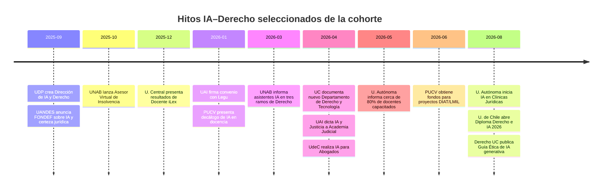

# Investigación avanzada inicial: IA y Derecho en la cohorte histórica de universidades chilenas

## Resumen ejecutivo

**Metadatos de esta entrega.** Cohorte: `COHORTE_IA_DERECHO_CHILE_11_V1`. Protocolo declarado: `METODOLOGIA_IA_DERECHO_V2.0`. Fecha de corte: **1 de septiembre de 2026**. Modelo utilizado: **GPT-5.5 Thinking**. Fecha de ejecución: **1 de septiembre de 2026**. Instituciones revisadas: `puc-chile`, `uchile`, `udp`, `uandes`, `uai`, `unab`, `udd`, `uautonoma`, `ucentral`, `pucv`, `udec`. Esta entrega es un **levantamiento inicial de registros propuestos**, no una versión publicable del informe: **ningún hallazgo se eleva a `ACEPTADO`**.

La primera conclusión metodológica es importante: **el informe anterior no puede conservarse como una base cuantitativa válida sin reconstrucción**. Contiene inconsistencias aritméticas, mezcla en ciertos lugares actividad propiamente relativa a IA con materias apenas adyacentes, emplea una escala distinta de la matriz 0–4 ahora exigida y, en al menos algunos casos, presenta como parte del panorama iniciativas posteriores a la fecha de corte o fechas que hoy aparecen modificadas en las páginas oficiales. fileciteturn0file1 El material metodológico anterior, además, exigía ampliar el universo más allá de las once universidades y comenzar con un piloto de tres instituciones, mientras el manifiesto actual ordena mantener una cohorte longitudinal cerrada de once; esa incompatibilidad queda registrada como conflicto documental y **no se integra silenciosamente**. fileciteturn0file0

La segunda conclusión es sustantiva pero todavía **provisional**: la fotografía de 2026 es sensiblemente más dinámica que la descrita por el informe heredado. En la búsqueda inicial aparecen señales fuertes de institucionalización en unidades de Derecho que el antecedente no capturó o capturó débilmente. Derecho UC cuenta ya con un **Departamento de Derecho y Tecnología** y desde el 21 de agosto de 2026 con una **Guía Ética para el uso de IA generativa** dirigida a sus estudiantes. citeturn0search21turn0search11 La UDP creó una **Dirección de Inteligencia Artificial y Derecho**, con mandato explícito de impulsar innovación curricular desde primer semestre hasta graduación, y en abril de 2026 firmó un convenio de I+D+i con empresas tecnológicas para desarrollar investigación aplicada en IA y Derecho. citeturn7search1turn1search2 La Universidad Autónoma informa una estrategia de alfabetización en IA que ya había alcanzado cerca del **80% del cuerpo docente de Derecho** en sus tres sedes en mayo de 2026 y, en agosto, inició un programa de **IA aplicada a la práctica clínica jurídica** de 18 semanas. citeturn8view1turn2search8

También existe evidencia especialmente relevante de adopción práctica. La Cuenta Pública 2025 de Derecho UNAB informa que se incorporó IA generativa como asistente virtual en Canvas en **tres asignaturas del primer ciclo de Derecho**, y la Facultad desarrolló junto con la Superintendencia de Insolvencia un asesor virtual basado en IA. citeturn8view0turn3search15 En Universidad Central, `Docente iLex` es un asistente generativo desarrollado desde Derecho para diseño y evaluación docente; a diciembre de 2025 registraba más de 300 consultas y había sido incorporado al plan de mejora de la carrera. citeturn5search2

Para la **PUCV**, la evidencia nueva obliga a matizar el diagnóstico de 2025. El informe heredado afirmaba que no se observaban herramientas internas ni lineamientos formales para IA. fileciteturn0file1 Desde enero de 2026 existe, al menos a nivel universitario, un **Decálogo sobre uso de IA en docencia con foco en integridad académica**, elaborado por la Unidad de Integridad Académica y liderado por una profesora de la Escuela de Derecho; además, Derecho PUCV obtuvo financiamiento interno competitivo para dos proyectos 2026 ejecutados desde LMIL y DIAT, uno de ellos específicamente sobre IA y prompting jurídico. citeturn4search6turn4search1 Esto **debilita** la afirmación amplia de que la PUCV carece de todo lineamiento o avance institucional, pero **no demuestra todavía** una capacidad coherente, transversal, financiada establemente y evaluada específicamente dentro de Derecho. La hipótesis estratégica sobre fragmentación institucional, por tanto, sigue abierta: ahora debe formularse con mayor precisión.

En esta primera pasada no aparece base suficiente para construir un ranking único. La heterogeneidad es demasiado grande: algunas evidencias son currículo vigente, otras currículo anunciado; algunas son políticas de Facultad, otras institucionales de alcance general; unas documentan cobertura y ejecución, mientras otras solo confirman eventos o convenios. Esta entrega propone por ello una **banda de actividad Alta/Media/Baja**, distinta y subordinada a la futura matriz de madurez 0–4.

## Plan de trabajo y reglas de integración

La investigación continúa en fases reproducibles, sin convertir automáticamente los hallazgos web en hechos canónicos.

| Fase | Operación | Producto canónico esperado |
|---|---|---|
| Verificación documental | Localizar manifiesto, protocolo V2.0, registros, decisiones humanas y último `HANDOFF`; comprobar versiones incompatibles | Registro de conflictos y mapa de autoridad |
| Auditoría heredada | Descomponer el informe 2025 en afirmaciones, fuentes, iniciativas y puntajes; recalcular aritmética | Tabla `2025→2026`: confirmado / actualizado / sustituido / no localizado / descartado |
| Búsqueda primaria | Consultas por universidad y por unidad de Derecho en sitios oficiales, posgrados, repositorios, documentos y noticias institucionales | Registro de fuentes |
| Extracción | Separar fuente, evidencia y afirmación; normalizar fecha, unidad, eje, dimensión, audiencia, continuidad y resultados | Matriz de evidencias |
| Contraste | Buscar una segunda fuente primaria cuando el hallazgo sostenga una afirmación importante; distinguir anuncio de ejecución | Evidencia `CONTRASTADO` propuesta, solo tras revisión posterior |
| Evaluación | Aplicar matriz 0–4 por dimensión únicamente a evidencia validada; publicar cobertura y confianza | Perfiles de madurez, no ranking automático |
| Síntesis y relevo | Actualizar afirmaciones afectadas, contradicciones, pendientes y búsquedas negativas | `HANDOFF` versionado |

Hay un **conflicto documental `CFLT-2026-001`** que debe conservarse abierto. El markdown anterior dispone definir un universo nacional y no limitar la investigación a las once universidades, además de comenzar con PUCV, UC y Universidad de Chile como piloto. fileciteturn0file0 El manifiesto entregado ahora establece una cohorte longitudinal cerrada de exactamente once. En esta ejecución se respeta la cohorte solicitada y se detiene únicamente la **integración de la regla incompatible**, no el levantamiento de evidencia. Ninguna universidad adicional ha sido incorporada a las comparaciones principales.

El expediente canónico completo tampoco está disponible en esta conversación. Se dispone del markdown metodológico anterior y del informe heredado, pero no de registros canónicos identificables para iniciativas, fuentes, evidencias, afirmaciones, decisiones humanas, changelog y `HANDOFF`. fileciteturn0file0turn0file1 Las búsquedas realizadas en el Drive conectado por los identificadores exactos `COHORTE_IA_DERECHO_CHILE_11_V1` y `METODOLOGIA_IA_DERECHO_V2.0` no devolvieron archivos. Por ello, **los IDs siguientes son nuevos IDs provisionales** y no reemplazan IDs canónicos que puedan existir fuera de lo actualmente accesible.

El criterio propuesto para la columna de **nivel de actividad** es deliberadamente distinto de “madurez”. **Alta** significa evidencia original y reciente en al menos tres tipos de actividad, incluyendo al menos una señal formal —estructura, política, currículo, financiamiento, convenio de I+D o implementación— y evidencia directamente atribuible a Derecho. **Media** significa actividad verificable en dos o más frentes, o una señal formal acompañada por varias actuaciones, pero sin demostrar todavía cobertura, continuidad o evaluación suficientes. **Baja** significa predominio de eventos, declaraciones o experiencias aisladas y falta de evidencia inicial de estructura o continuidad. Este criterio queda en `PROPUESTO`; no es un puntaje canónico.

## Auditoría inicial del antecedente y cambios metodológicos

El informe heredado es valioso como inventario de pistas, pero no es una base cuantitativa reproducible en su forma actual. fileciteturn0file1 Los problemas más claros que deben corregirse antes de reutilizar cualquier resultado son los siguientes.

| Incidencia | Observación | Tratamiento propuesto |
|---|---|---|
| `AUD-001` | En UAI las dimensiones impresas son 0 + 1,5 + 3 + 3 + 0 = **7,5**, pero el total publicado es **6,2**. | Recalcular exclusivamente desde registros estructurados; total 2025 queda `SUPERADO` como cifra analítica. fileciteturn0file1 |
| `AUD-002` | En UNAB las dimensiones impresas suman **7,75**, pero el total señalado es **8,75**; además, los cuatro subítems de uso interno de 0,25 suman 1, no 2. | No reutilizar total ni subtotal. fileciteturn0file1 |
| `AUD-003` | En U. Central la dimensión “Pregrado” figura como 1, pero la actividad que contiene recibe 1,5; el total 8,5 parece usar 1,5 y no el encabezado. | Marcar inconsistencia de agregación. fileciteturn0file1 |
| `AUD-004` | En UDD la formación continua aparece con “3+”, mientras nueve actividades de 0,25 totalizan 2,25. | Sustituir sumatoria manual por cálculo desde base. fileciteturn0file1 |
| `AUD-005` | En UDP la sección I+D figura con 0,75, pero sus tres subítems declarados son 0,5 + 0,25 + 0,25 = 1. | Revisar además si todos cumplen definición sustantiva de IA. fileciteturn0file1 |
| `AUD-006` | Se contabilizan de manera frecuente protección de datos, ciberseguridad, PI, transformación digital y otras materias sin demostrar siempre que IA sea componente sustantivo. | Bajo V2.0 deben pasar a `ADYACENTE` salvo prueba explícita de IA. fileciteturn0file0turn0file1 |
| `AUD-007` | El antecedente incorpora como actividad algunos programas posteriores al 1-sep-2026. | Deben clasificarse como `ANUNCIADO`, no como stock ejecutado a la fecha de corte. fileciteturn0file1 |
| `AUD-008` | La fecha del Diplomado UNAB aparece en el antecedente como 6-sep-2026; la página oficial hoy señala inicio 28-ago-2026. | Crear actualización documental, no sobrescribir la pista antigua. citeturn3search17 |
| `AUD-009` | El informe dice que PUCV no registra lineamientos formales de IA. | La afirmación necesita actualización: desde enero de 2026 existe un decálogo institucional de IA en docencia, liderado por una profesora de Derecho; falta acreditar implementación específica en la Escuela. citeturn4search6 |
| `AUD-010` | El antecedente se refiere a un “Centro de Inteligencia Artificial y Derecho” en UDP. | La estructura oficial verificable es una **Dirección de Inteligencia Artificial y Derecho**, creada en 2025 y actualmente reflejada en la estructura de Facultad. Debe verificarse si el supuesto “Centro” era otra entidad o una denominación imprecisa. citeturn7search1turn7search11 |

La nueva matriz de madurez 0–4 tampoco es equivalente a la escala de 0–3 y a los micro-puntajes de 0,25–1,5 del informe anterior. fileciteturn0file1 No debe hacerse ninguna conversión aritmética directa. En particular, “tener un centro”, “hacer varios seminarios” o “ofrecer numerosos diplomados” no basta para nivel 3; y no debe asignarse nivel 4 sin resultados o evaluación públicamente revisables.

## Recolección inicial y comparación por universidad

La tabla siguiente sintetiza **solo evidencia pública inicialmente verificada**. “Alta/Media/Baja” es la banda operativa propuesta arriba, no una evaluación canónica de madurez y no alimenta todavía conclusiones publicables.

| ID canónico | Iniciativas clave verificadas inicialmente | Actividad inicial | Fuentes principales |
|---|---|---:|---|
| `puc-chile` | Departamento de Derecho y Tecnología; Programa de Derecho, Ciencia y Tecnología; diplomado recurrente en Derecho e IA; Guía Ética de IA generativa de Facultad | **Alta** | [Guía Ética, 21-08-2026](https://derecho.uc.cl/facultad-de-derecho-uc-establece-guia-etica-para-uso-de-inteligencia-artificial-generativa/); [Departamento de Derecho y Tecnología](https://derecho.uc.cl/expertos-extranjeros-y-academicos-de-derecho-uc-analizaron-la-etica-en-la-inteligencia-artificial/); graduación de la generación 2025 del Diplomado en Derecho e IA. citeturn0search11turn0search21turn0search22 |
| `uchile` | CE3 con actividad recurrente; Diploma en Derecho e IA 2026; investigación y actividades sobre regulación, derechos de autor e IA | **Alta** | [Diploma 2026](https://postgrados.derecho.uchile.cl/diploma-derecho-e-inteligencia-artificial/); encuentros CE3 de mayo-junio de 2026; congreso sobre IA, Derecho Privado y consumo. citeturn0search14turn0search0turn0search12turn0search10 |
| `udp` | Dirección de Inteligencia Artificial y Derecho; innovación curricular anunciada desde primer semestre; convenio I+D+i con Quantico y Merlín Research | **Alta** | [Creación de la Dirección](https://derecho.udp.cl/academico-rafael-mery-es-nombrado-director-de-inteligencia-artificial-y-derecho-udp/); [convenio I+D+i](https://investigacioneinnovacion.udp.cl/nuevo-convenio-entre-udp-y-sector-tecnologico-busca-potenciar-desarrollos-en-inteligencia-artificial-y-derecho/). citeturn7search1turn1search2 |
| `uandes` | Proyecto FONDEF de IA para certeza jurídica en evaluación ambiental; DOMus AI para revisión normativa de permisos de edificación | **Media** | [FONDEF certeza jurídica](https://www.uandes.cl/actualidad/noticias/investigacion-aplicara-ia-para-mejorar-la-certeza-juridica-en-la-evaluacion-ambiental-de-proyectos-en-chile/); [DOMus AI](https://www.uandes.cl/actualidad/noticias/ia-al-servicio-de-la-edificacion-prototipo-del-cet-e-ingenieria-fue-finalista-en-concurso-del-gobierno-y-el-bid/). Son proyectos interdisciplinares; la atribución específica a Derecho debe conservar ese matiz. citeturn5search0turn5search6 |
| `uai` | Laboratorio de Justicia Centrada en las Personas; curso “IA y Justicia” para Academia Judicial; convenio de Derecho con legaltech Legu | **Media** | [Curso Academia Judicial](https://www.uai.cl/noticias/derecho/laboratorio-de-justicia-centrada-en-las-personas-uai-dicta-curso-de-ia-para-la-academia-judicial); [convenio Legu](https://alumni.uai.cl/news/noticias-uai/905/905-Facultad-de-Derecho-firma-convenio-con-Legu-legaltech-que-impulsa-el-acceso-al-derecho-mediante-IA); actividad investigativa del Laboratorio. citeturn7search0turn7search7turn7search14 |
| `unab` | Asistente generativo en Canvas en tres asignaturas de Derecho; Asesor Virtual de Insolvencia; Diplomado Derecho, Innovación y Tecnología | **Alta** | [Cuenta Pública de Derecho](https://noticias.unab.cl/facultad-de-derecho-unab-presento-su-cuenta-publica-2025-con-foco-en-innovacion-internacionalizacion-y-fortalecimiento-academico/); [Asesor Virtual de Insolvencia](https://noticias.unab.cl/unab-lanzo-asesor-virtual-de-insolvencia/); [Diplomado](https://postgrado.unab.cl/programas/diplomado-en-derecho-innovacion-y-tecnologia/). citeturn8view0turn3search15turn3search17 |
| `udd` | Nueva malla anuncia talleres de herramientas digitales e IA en Derecho; experiencia de entrenamiento en IA/realidad virtual para debate y litigación; actividad doctoral y publicaciones sobre regulación de IA | **Media** | [Malla/admisión Derecho](https://derecho.udd.cl/carrera/derecho/); [RealitecUDD](https://derecho.udd.cl/noticias/2025/04/estudiantes-de-debate-y-litigacion-udd-entrenan-con-inteligencia-artificial-en-realitecudd/); workshop doctoral 2026. citeturn6search0turn6search13turn2search19 |
| `uautonoma` | Alfabetización de cerca del 80% de docentes de Derecho; despliegue en tres sedes; programa de IA en Clínicas Jurídicas; microcredencial internacional IA/consumidor | **Alta** | [Alfabetización docente](https://www.uautonoma.cl/noticias/alfabetizacion-en-ia-generativa-en-derecho-alcanza-al-80-de-docentes-y-se-amplia-a-estudiantes/); [IA en Clínicas Jurídicas](https://www.uautonoma.cl/noticias/facultad-de-derecho-pone-en-marcha-innovador-programa-de-formacion-en-inteligencia-artificial-para-estudiantes-de-sus-clinicas-juridicas/); microcredencial 2026. citeturn8view1turn2search8turn2search15 |
| `ucentral` | Docente iLex; incorporación al plan de mejora de Derecho; IDEA UCEN como infraestructura universitaria de búsqueda con IA; producción doctoral sobre responsabilidad algorítmica | **Alta** | [Docente iLex](https://noticias.ucentral.cl/noticias/u-central-destaca-en-el-latin-america-innovation-showcase-del-qs-reimagine-education-conference-2025-con-innovadora-practica-docente/); [IDEA UCEN](https://noticias.ucentral.cl/noticias/universidad-central-presenta-idea-ucen-nueva-plataforma-de-busqueda/); [Revista DIE 2026](https://noticias.ucentral.cl/noticias/inteligencia-artificial-derechos-fundamentales-revista-die/). citeturn5search2turn5search1turn3search14 |
| `pucv` | DIAT y LMIL; financiamiento VcM 2026 para dos iniciativas; Taller de IA y Prompting Jurídico; workshop internacional; decálogo institucional de IA docente con liderazgo desde Derecho | **Media** | [Fondos VcM 2026](https://www.pucv.cl/uuaa/derecho-pucv/noticias/facultad-y-escuela-de-derecho-pucv-se-adjudican-dos-proyectos-de); [Decálogo](https://www.pucv.cl/pucv/noticias/destacadas/universidad-presento-decalogo-para-el-uso-etico-de-la-inteligencia); [workshop internacional](https://www.pucv.cl/uuaa/derecho-pucv/noticias/profesor-james-m-cooper-encabezo-workshop-internacional-sobre-manejo-de). citeturn4search1turn4search6turn4search3 |
| `udec` | Seminario práctico “IA para Abogados”; seminario interdisciplinario “Derecho en la Smart Era”; sesiones de Doctorado sobre Derecho Procesal e IA | **Baja** | [Seminario IA para Abogados](https://jur.udec.cl/content/facultad-de-ciencias-jur%C3%ADdicas-y-sociales-udec-realiz%C3%B3-seminario-sobre-inteligencia); [Derecho en la Smart Era](https://www.juridicasysociales.udec.cl/content/seminario-%E2%80%9Cderecho-en-la-smart-era%E2%80%9D-reuni%C3%B3-destacados-expositores-y-una-gran-audiencia-en-la); sesiones doctorales. El nivel bajo refleja falta de evidencia inicial de estructura permanente, no ausencia de actividad. citeturn9search1turn9search3turn9search7 |

Un timeline de hitos seleccionados muestra que buena parte de la señal de institucionalización relevante se concentra entre septiembre de 2025 y agosto de 2026; el gráfico no representa exhaustividad ni madurez:

Los hitos anteriores derivan de fuentes oficiales de las respectivas universidades y deben leerse como fechas de evidencia pública, no necesariamente como fecha de nacimiento de toda la capacidad institucional. citeturn7search1turn5search0turn3search15turn5search2turn7search7turn4search6turn8view0turn0search21turn7search0turn9search2turn8view1turn4search1turn2search8turn0search14turn0search11

## Matriz nueva de evidencias y registros propuestos

**Regla de estado:** todos los registros de esta sección quedan en `PROPUESTO`. La fuente pública fue efectivamente abierta en esta ejecución, por lo que el campo documental se anota como `FUENTE_ABIERTA`. **Fecha de consulta de todas las fuentes: 01-09-2026.** Los identificadores `ANT-...` son referencias temporales al antecedente 2025; no se presentan como IDs canónicos preexistentes.

| Registro propuesto | Universidad | Eje / dimensión | Fuente original, fecha y tipo | Evidencia extraída | Estado / relación con antecedente | Explicación del cambio |
|---|---|---|---|---|---|---|
| `PROP-PUC-001` | `puc-chile` | `AMBOS` / gobernanza-política | [Guía Ética para uso de IA generativa](https://derecho.uc.cl/facultad-de-derecho-uc-establece-guia-etica-para-uso-de-inteligencia-artificial-generativa/), 21-08-2026, documento/noticia oficial de Facultad | Derecho UC establece lineamientos para estudiantes sobre utilización de IA generativa según objetivos formativos, planificación y reglas del profesor. | `PROPUESTO`; fuente `FUENTE_ABIERTA`; **actualiza** `ANT-PUC-USO-INTERNO`. | El antecedente registraba orientaciones generales UC, pero no esta guía específica de Derecho; es una señal formal más fuerte. citeturn0search11 |
| `PROP-PUC-002` | `puc-chile` | `DERECHO_DE_IA` / estructura institucional | [Seminario de ética en IA](https://derecho.uc.cl/expertos-extranjeros-y-academicos-de-derecho-uc-analizaron-la-etica-en-la-inteligencia-artificial/), 10-04-2026, noticia institucional | La fuente identifica a Raúl Madrid como director del **recientemente creado Departamento de Derecho y Tecnología** de la Facultad. | `PROPUESTO`; **sustituye/amplía** la caracterización basada solo en el Programa Derecho, Ciencia y Tecnología. | Aparece una estructura departamental formal no descrita en el antecedente. Falta recuperar acto de creación para máxima autoridad documental. citeturn0search21 |
| `PROP-UCH-001` | `uchile` | `AMBOS` / postgrado-formación continua | [Diploma Derecho e Inteligencia Artificial](https://postgrados.derecho.uchile.cl/diploma-derecho-e-inteligencia-artificial/), 01-08-2026, página oficial de postgrado | Facultad ofrece versión del Diploma en Derecho e IA en el segundo semestre de 2026, bajo el CE3. | `PROPUESTO`; **confirma continuidad** del antecedente. | Sustituye la dependencia en versiones 2022/2023 como única prueba de existencia y aporta evidencia contemporánea al corte. citeturn0search14turn0search15turn0search18 |
| `PROP-UCH-002` | `uchile` | `DERECHO_DE_IA` / investigación-vinculación | [Encuentro sobre excepción de derechos de autor e IA](https://derecho.uchile.cl/agenda/241228/consideraciones-para-una-excepcion-de-derechos-de-autor-en-la), 16-06-2026, agenda oficial | CE3 organiza actividad específica sobre excepción de derecho de autor para formación de IA; existe actividad relacionada también el 27-05-2026 sobre minería de datos e IA. | `PROPUESTO`; **confirma** actividad recurrente CE3. | Refuerza continuidad 2026, pero por sí sola no eleva madurez: es actividad de extensión/investigación. citeturn0search0turn0search12 |
| `PROP-UDP-001` | `udp` | `IA_PARA_DERECHO` / gobernanza y currículo | [Nombramiento Director de IA y Derecho](https://derecho.udp.cl/academico-rafael-mery-es-nombrado-director-de-inteligencia-artificial-y-derecho-udp/), 12-09-2025, noticia oficial | La Facultad crea una Dirección de IA y Derecho como espacio de reflexión y decisión para innovación curricular; anuncia Taller de IA en Escritura Legal desde primer semestre y curso de tecnología/IA hacia el final de la carrera. | `PROPUESTO`; **sustituye** la referencia no verificada a un “Centro de IA y Derecho”. | Es una señal de institucionalización considerablemente más precisa; todavía se debe comprobar ejecución efectiva de cada cambio curricular anunciado. citeturn7search1turn7search8 |
| `PROP-UDP-002` | `udp` | `IA_PARA_DERECHO` / I+D+i, alianza | [Convenio UDP–Quantico–Merlín](https://investigacioneinnovacion.udp.cl/nuevo-convenio-entre-udp-y-sector-tecnologico-busca-potenciar-desarrollos-en-inteligencia-artificial-y-derecho/), 07-04-2026, noticia oficial de Investigación e Innovación | Derecho UDP, a través de la Vicerrectoría, suscribe convenio I+D+i para investigación aplicada, desarrollo tecnológico y transferencia en IA y Derecho. | `PROPUESTO`; **nuevo** respecto del antecedente. | Pasa de seminarios/capacitación a un mecanismo formal de colaboración tecnológica; faltan proyectos, presupuesto y resultados concretos. citeturn1search2 |
| `PROP-UANDES-001` | `uandes` | `IA_PARA_DERECHO` / investigación aplicada-financiamiento | [IA y certeza jurídica ambiental](https://www.uandes.cl/actualidad/noticias/investigacion-aplicara-ia-para-mejorar-la-certeza-juridica-en-la-evaluacion-ambiental-de-proyectos-en-chile/), 22-09-2025, noticia oficial | Proyecto FONDEF busca escalar y transferir plataforma de IA que procesa normativa, jurisprudencia y datos ambientales para apoyar el SEIA; el equipo es interdisciplinario e incluye especialistas jurídicos de UANDES y PUCV. | `PROPUESTO`; **confirma y amplía** `ANT-UANDES-I+D`. | El antecedente ya detectó el proyecto; la fuente permite clasificarlo mejor como IA aplicada a un problema jurídico-administrativo con financiamiento competitivo. citeturn5search0 |
| `PROP-UANDES-002` | `uandes` | `IA_PARA_DERECHO` / prototipo-regulación | [DOMus AI](https://www.uandes.cl/actualidad/noticias/ia-al-servicio-de-la-edificacion-prototipo-del-cet-e-ingenieria-fue-finalista-en-concurso-del-gobierno-y-el-bid/), 27-10-2025, noticia institucional | CET e Ingeniería desarrollan plataforma para revisión automatizada de normas y formularios de permisos, orientada a uniformidad, trazabilidad y certeza jurídica. | `PROPUESTO`; **nuevo**. | Evidencia fuerte de IA aplicada a regulación, pero la unidad principal no es Derecho; debe mantenerse como iniciativa interdisciplinar atribuible a la universidad, no automáticamente a la Facultad de Derecho. citeturn5search6turn5search11 |
| `PROP-UAI-001` | `uai` | `IA_PARA_DERECHO` / formación-vinculación | [Curso IA y Justicia para Academia Judicial](https://www.uai.cl/noticias/derecho/laboratorio-de-justicia-centrada-en-las-personas-uai-dicta-curso-de-ia-para-la-academia-judicial), 22-04-2026, noticia oficial Derecho | Laboratorio de Justicia Centrada en las Personas dicta una nueva versión de formación aplicada sobre IA, ética, debido proceso y estándares internacionales para la Academia Judicial. | `PROPUESTO`; **nuevo/actualiza** el perfil demasiado centrado en GobLab del antecedente. | Aporta evidencia directamente atribuible a la Facultad de Derecho, algo que el informe anterior subestimaba al apoyar buena parte de su evaluación en la Escuela de Gobierno. citeturn7search0 |
| `PROP-UAI-002` | `uai` | `IA_PARA_DERECHO` / alianza legaltech | [Convenio Derecho UAI–Legu](https://alumni.uai.cl/news/noticias-uai/905/905-Facultad-de-Derecho-firma-convenio-con-Legu-legaltech-que-impulsa-el-acceso-al-derecho-mediante-IA), 12-01-2026; convenio firmado 06-01-2026; noticia institucional | Facultad de Derecho acuerda colaboración con legaltech basada en IA para ampliar acceso a información y servicios jurídicos. | `PROPUESTO`; **nuevo**. | Agrega una alianza IA-derecho directamente facultativa; todavía no hay evidencia pública suficiente sobre cobertura estudiantil, productos o resultados del convenio. citeturn7search7 |
| `PROP-UNAB-001` | `unab` | `IA_PARA_DERECHO` / pregrado-uso interno | [Cuenta Pública Derecho UNAB 2025](https://noticias.unab.cl/facultad-de-derecho-unab-presento-su-cuenta-publica-2025-con-foco-en-innovacion-internacionalizacion-y-fortalecimiento-academico/), 01-03-2026, rendición institucional | La Facultad informa asistentes de IA generativa integrados en Canvas en Introducción al Derecho, Derecho de los Bienes y Teoría de los Derechos y Acciones Constitucionales. | `PROPUESTO`; **confirma y precisa** `ANT-UNAB-PREGRADO/USO`. | Es una de las evidencias más sólidas del conjunto porque identifica cursos concretos y la propia Facultad lo reporta como resultado 2025. citeturn8view0 |
| `PROP-UNAB-002` | `unab` | `IA_PARA_DERECHO` / herramienta-transferencia | [Asesor Virtual de Insolvencia](https://noticias.unab.cl/unab-lanzo-asesor-virtual-de-insolvencia/), 27-10-2025; lanzamiento 23-10-2025; noticia institucional | Facultad de Derecho, Transferencia Tecnológica UNAB y Superintendencia de Insolvencia lanzan asesor basado en IA para orientación personalizada sobre insolvencia. | `PROPUESTO`; **confirma** antecedente. | Conviene elevarlo de “actividad” a proyecto aplicado y luego buscar métricas de usuarios, precisión, continuidad y gobernanza de datos. citeturn3search15 |
| `PROP-UDD-001` | `udd` | `IA_PARA_DERECHO` / pregrado-currículo | [Derecho UDD, admisión/malla 2027](https://derecho.udd.cl/carrera/derecho/), vigente al 01-09-2026, página académica oficial | La nueva malla declara “LegalTech + IA” e incluye Talleres de Herramientas Digitales e Inteligencia Artificial en Derecho y Análisis de Datos e Investigación Jurídica. | `PROPUESTO`; **actualiza** antecedente. | La evidencia prueba diseño curricular anunciado, pero la página está orientada a Admisión 2027; no debe tratarse sin más como curso ya ejecutado en 2026. citeturn6search0turn8view2 |
| `PROP-UDD-002` | `udd` | `IA_PARA_DERECHO` / docencia práctica | [Entrenamiento en RealitecUDD](https://derecho.udd.cl/noticias/2025/04/estudiantes-de-debate-y-litigacion-udd-entrenan-con-inteligencia-artificial-en-realitecudd/), 09-04-2025, noticia oficial | Estudiantes de Debate y Litigación realizaron entrenamiento práctico con tecnologías que incluyen IA y realidad virtual para habilidades orales y argumentativas. | `PROPUESTO`; **nuevo** frente al perfil heredado de “uso interno 0”. | Es evidencia de uso pedagógico efectivo, aunque focalizado en un grupo y no suficiente para sostener adopción transversal. citeturn6search13 |
| `PROP-UAUT-001` | `uautonoma` | `IA_PARA_DERECHO` / docencia-gobernanza | [Alfabetización IA en Derecho](https://www.uautonoma.cl/noticias/alfabetizacion-en-ia-generativa-en-derecho-alcanza-al-80-de-docentes-y-se-amplia-a-estudiantes/), 27-05-2026, noticia oficial | Una decena de talleres alcanza cerca del 80% del cuerpo docente de Derecho de Santiago, Talca y Temuco; comienza extensión a estudiantes y una segunda etapa de implementación de actividades mediadas por IA. | `PROPUESTO`; **contradice/sustituye** `ANT-UAUT-USO=0`. | La afirmación heredada de ausencia de uso interno ya no es sostenible al corte de 2026. Falta medir cuántos docentes efectivamente implementaron luego actividades en sus cursos. citeturn8view1 |
| `PROP-UAUT-002` | `uautonoma` | `IA_PARA_DERECHO` / clínica-pregrado | [IA aplicada a Clínicas Jurídicas](https://www.uautonoma.cl/noticias/facultad-de-derecho-pone-en-marcha-innovador-programa-de-formacion-en-inteligencia-artificial-para-estudiantes-de-sus-clinicas-juridicas/), 10-08-2026, noticia oficial | Programa de 18 semanas para estudiantes diurnos y vespertinos de Clínicas Jurídicas en las tres sedes, con prompting jurídico, automatización, análisis documental y agentes especializados. | `PROPUESTO`; **nuevo**. | Es una señal fuerte de implementación en práctica jurídica supervisada y cobertura multicampus; resultados todavía no estaban disponibles al corte. citeturn2search8 |
| `PROP-UCEN-001` | `ucentral` | `IA_PARA_DERECHO` / herramienta docente-evaluación | [Docente iLex](https://noticias.ucentral.cl/noticias/u-central-destaca-en-el-latin-america-innovation-showcase-del-qs-reimagine-education-conference-2025-con-innovadora-practica-docente/), 03-12-2025, noticia oficial | Asistente generativo desarrollado por Derecho para retroalimentación, rúbricas, casos y metodologías activas; más de 300 consultas y adhesión al plan de mejora de la carrera. | `PROPUESTO`; **confirma y fortalece** antecedente. | La fuente aporta indicadores de uso y una señal de integración a mejora curricular que justifican nueva evaluación de madurez. citeturn5search2turn8view3 |
| `PROP-UCEN-002` | `ucentral` | `DERECHO_DE_IA` / publicación-investigación | [Revista DIE, tercer número](https://noticias.ucentral.cl/noticias/inteligencia-artificial-derechos-fundamentales-revista-die/), 25-08-2026, noticia oficial | Publicación del Doctorado aborda responsabilidad algorítmica, datos y derechos fundamentales; editorial dedicada a Derecho e IA. | `PROPUESTO`; **nuevo/actualiza** investigación. | Aporta producción académica verificable, pero no se confunde con uso de IA ni con una estructura de investigación por sí misma. citeturn3search14 |
| `PROP-PUCV-001` | `pucv` | `IA_PARA_DERECHO` / financiamiento-vinculación | [Fondos VcM Derecho PUCV](https://www.pucv.cl/uuaa/derecho-pucv/noticias/facultad-y-escuela-de-derecho-pucv-se-adjudican-dos-proyectos-de), 03-06-2026, noticia oficial | LMIL y DIAT obtienen Fondos Concursables VcM 2026 para Innova Day y Taller de IA y Prompting Jurídico; uno contempla colaboración con Ingeniería y Centro Interdisciplinario de Ingeniería. | `PROPUESTO`; **confirma y amplía** iniciativas LMIL/DIAT. | El antecedente trataba principalmente actividades; ahora existe evidencia explícita de adjudicación competitiva interna. La fuente no informa monto, por lo que no se inventa presupuesto. citeturn4search1 |
| `PROP-PUCV-002` | `pucv` | `AMBOS` / política docente institucional | [Decálogo IA en docencia PUCV](https://www.pucv.cl/pucv/noticias/destacadas/universidad-presento-decalogo-para-el-uso-etico-de-la-inteligencia), 09-01-2026, noticia institucional | La Universidad presenta decálogo para uso de IA en docencia e integridad académica, elaborado por la unidad correspondiente y liderado por Claudia Poblete, profesora de Derecho. | `PROPUESTO`; **contradice parcialmente** la frase heredada “no se identifican lineamientos formales”. | Prueba existencia de lineamiento institucional universitario. No prueba todavía política propia de Derecho ni su nivel de cumplimiento en la Escuela. citeturn4search6 |
| `PROP-PUCV-003` | `pucv` | `AMBOS` / formación-vinculación | [Workshop internacional IA legal](https://www.pucv.cl/uuaa/derecho-pucv/noticias/profesor-james-m-cooper-encabezo-workshop-internacional-sobre-manejo-de), 18-06-2026, noticia oficial de Derecho | Derecho PUCV ejecuta workshop para alumni sobre manejo de IA en el ámbito legal, gobernanza, regulación e implementación responsable. | `PROPUESTO`; **nuevo/continuidad**. | Ayuda a demostrar actividad efectiva posterior a la creación de DIAT, pero sigue siendo evidencia de extensión y no de currículo obligatorio o estructura financiada permanentemente. citeturn4search3 |
| `PROP-UDEC-001` | `udec` | `IA_PARA_DERECHO` / formación práctica | [IA para Abogados](https://jur.udec.cl/content/facultad-de-ciencias-jur%C3%ADdicas-y-sociales-udec-realiz%C3%B3-seminario-sobre-inteligencia), actividad 21-04-2026, noticia oficial | Facultad realiza sesión con demostraciones de modelos de lenguaje para lectura, investigación, redacción y argumentación jurídica. | `PROPUESTO`; **nuevo/actualiza** perfil 2025. | Evidencia de enseñanza práctica de herramientas, pero todavía como seminario, no como componente curricular recurrente. citeturn9search1turn9search2 |
| `PROP-UDEC-002` | `udec` | `AMBOS` / vinculación-formación interdisciplinaria | [Derecho en la Smart Era](https://www.juridicasysociales.udec.cl/content/seminario-%E2%80%9Cderecho-en-la-smart-era%E2%80%9D-reuni%C3%B3-destacados-expositores-y-una-gran-audiencia-en-la), 02-10-2025, actividad en Facultad | Seminario aborda IA, regulación, práctica jurídica, cibercrimen, innovación y herramientas para la abogacía; organizado por el Centro de estudiantes con participación de autoridades y académicos. | `PROPUESTO`; **confirma** antecedente. | Debe conservarse como actividad estudiantil/institucional apoyada por Facultad, no equipararla a centro, política o programa permanente. citeturn9search0turn9search3 |

### Lectura preliminar de la matriz

Tres cambios respecto del antecedente merecen prioridad en la siguiente ronda de validación.

Primero, **la adopción interna ya no parece ser una dimensión uniformemente vacía**. UNAB reporta asistentes generativos en cursos concretos de Derecho; U. Central tiene `Docente iLex` y un asistente bibliográfico institucional; U. Autónoma está desplegando capacitación masiva y uso en Clínicas; Derecho UC adoptó una guía ética formal; PUCV cuenta al menos con lineamientos universitarios de docencia en IA, aunque aún debe demostrarse la traducción específica en Derecho. citeturn8view0turn5search2turn5search1turn8view1turn2search8turn0search11turn4search6

Segundo, **hay un salto de “actividad” a “estructura” en algunas facultades**. El Departamento de Derecho y Tecnología de Derecho UC y la Dirección de Inteligencia Artificial y Derecho de la UDP son señales más fuertes que una sucesión de seminarios. citeturn0search21turn7search1 Sin embargo, la matriz 0–4 exige algo más que denominación: deben recuperarse actos formales, funciones, recursos, cobertura y continuidad antes de otorgar nivel 3.

Tercero, **la posición relativa de la PUCV no puede derivarse ya del puntaje 3,25 del informe anterior**. fileciteturn0file1 En 2026 hay nueva evidencia favorable: fondos internos, ejecución desde DIAT/LMIL, colaboración interdisciplinaria y un marco institucional de integridad en IA. citeturn4search1turn4search3turn4search6 Aun así, esta primera búsqueda no ha encontrado evidencia pública comparable a la UDP sobre una autoridad de Facultad con mandato transversal curricular, a UNAB sobre asistentes desplegados en asignaturas jurídicas concretas, a U. Autónoma sobre cobertura masiva del cuerpo docente y clínicas, o a U. Central sobre una herramienta jurídica acompañada de métricas de uso. citeturn7search1turn8view0turn8view1turn2search8turn5search2 Esa brecha es una **inferencia provisional**, no una conclusión aceptada.

## Contradicciones, pendientes y preguntas de validación

### Contradicciones registradas

`CFLT-2026-001` es el conflicto de alcance ya señalado: universo nacional/piloto de tres en el markdown anterior frente a cohorte longitudinal cerrada de once en el manifiesto actual. fileciteturn0file0

`CFLT-2026-002` afecta a **UDP**: el informe heredado registra un “Centro de Inteligencia Artificial y Derecho”, mientras las fuentes oficiales localizadas identifican una **Dirección de Inteligencia Artificial y Derecho**, cuyo director forma además parte del Consejo de Facultad. fileciteturn0file1 citeturn7search1turn7search11 No debe asumirse que ambas denominaciones describen la misma estructura hasta localizar una fuente del supuesto centro.

`CFLT-2026-003` afecta a **PUCV**: “no se identifican lineamientos formales” ya no es correcto si se interpreta a nivel de Universidad, porque en enero de 2026 se presentó un decálogo institucional de IA para docencia e integridad académica. fileciteturn0file1 citeturn4search6 Sigue pendiente saber si la Escuela de Derecho tiene un protocolo adicional, cómo aplica el decálogo y si hay supervisión o evaluación.

`CFLT-2026-004` afecta a **Universidad Autónoma**: la antigua puntuación de cero en uso interno no es compatible con la evidencia de mayo-agosto de 2026 sobre capacitación del cuerpo docente, implementación estudiantil y práctica clínica apoyada por IA. fileciteturn0file1 citeturn8view1turn2search8 El registro antiguo debe permanecer como fotografía histórica de la evidencia disponible entonces, no sobrescribirse.

`CFLT-2026-005` afecta a **UDD**: la página oficial actual prueba que la nueva malla para Admisión 2027 incorpora LegalTech e IA, pero ello no demuestra automáticamente que el taller estuviera siendo cursado por cohortes 2026. citeturn6search0 El informe anterior lo trataba como incorporación de pregrado sin esta distinción temporal. fileciteturn0file1

`CFLT-2026-006` afecta a **UNAB**: la fecha heredada para el Diplomado en Derecho, Innovación y Tecnología no coincide con la página oficial actualmente accesible, que indica inicio el **28 de agosto de 2026**. fileciteturn0file1 citeturn3search17 Debe preservarse la fuente de 2025 que originó la fecha anterior antes de decidir si fue reprogramación o error.

### Pendientes de búsqueda de máxima prioridad

La mayor carencia transversal no es encontrar más seminarios, sino **documentar institucionalización**. Para las once universidades faltan, en grados distintos, resoluciones de creación, presupuestos, dedicación de personal, matrícula o número de beneficiarios, syllabus efectivos, resultados de aprendizaje, métricas de utilización de herramientas, protocolos de datos, evaluación y continuidad 2025–2026.

En `puc-chile`, la siguiente prioridad es conseguir el acto formal de creación y funciones del Departamento de Derecho y Tecnología, y establecer la relación orgánica entre Departamento y Programa Derecho, Ciencia y Tecnología. La guía ética de agosto de 2026 también debe recuperarse como documento íntegro, no solo a través de la noticia institucional. citeturn0search11turn0search21

En `uchile`, hay abundante evidencia de investigación y extensión, pero debe verificarse el **currículo de pregrado 2026**, el número de versiones efectivamente impartidas del Diploma de Derecho e IA y cualquier política de Facultad sobre IA generativa. La recurrencia del diploma y la actividad CE3 están públicamente documentadas, pero no equivalen por sí solas a adopción interna. citeturn0search14turn0search0

En `udp`, la cuestión decisiva es comprobar qué parte del diseño anunciado en septiembre de 2025 —taller desde primer semestre, curso en semestres finales e integración transversal— está efectivamente incorporada al currículo 2026 y con qué cobertura. citeturn7search1 También deben identificarse productos concretos del convenio I+D+i de abril. citeturn1search2

En `uandes`, los proyectos de certeza jurídica son sólidos como investigación aplicada, pero la conexión con la **unidad académica de Derecho** debe desagregarse cuidadosamente. El proyecto FONDEF es explícitamente interdisciplinario y DOMus AI se origina principalmente en CET e Ingeniería. citeturn5search0turn5search6 Falta rastrear currículo, formación docente y gobernanza propia de Derecho.

En `uai`, la nueva evidencia directa de la Facultad de Derecho corrige una debilidad metodológica del antecedente, que asignaba gran peso a GobLab pese a ser una unidad de Gobierno. fileciteturn0file1 El Laboratorio de Justicia Centrada en las Personas, su curso para Academia Judicial y la alianza con Legu son comparadores más limpios para el análisis jurídico. citeturn7search0turn7search7 Debe buscarse ahora integración en pregrado y herramientas disponibles a estudiantes.

En `unab`, la prioridad es auditar el asistente de Canvas: qué modelo utiliza, quién lo diseñó, número de estudiantes, reglas de privacidad, resultados frente a reprobación y continuidad en 2026. La Cuenta Pública constituye una fuente institucional especialmente útil porque presenta la iniciativa como un resultado formal de la Facultad. citeturn8view0 El Asesor Virtual de Insolvencia requiere métricas de operación y gobernanza. citeturn3search15

En `udd`, debe verificarse el año exacto de entrada en vigencia del nuevo plan de estudios. La página de Admisión 2027 no basta para afirmar que el taller ya forma parte del stock curricular cursado al 1-sep-2026. citeturn6search0 La experiencia Realitec, aunque práctica, requiere aclarar si fue puntual o recurrente. citeturn6search13

En `uautonoma`, las fuentes de 2026 son muy prometedoras precisamente porque incluyen **cobertura**, aspecto ausente en muchas otras universidades. La Facultad declara diez talleres y cerca de 80% del cuerpo docente alcanzado, así como expansión a estudiantes. citeturn8view1 La siguiente ronda debe buscar resultados de la segunda etapa y del programa clínico de 18 semanas iniciado el 10 de agosto, pues a la fecha de corte llevaba pocas semanas de ejecución. citeturn2search8

En `ucentral`, `Docente iLex` tiene un grado inusual de observabilidad pública —función, consultas y vinculación con el plan de mejora—, pero faltan denominador, número de docentes usuarios, evaluación del aprendizaje y continuidad durante 2026. citeturn5search2 IDEA UCEN es una capacidad institucional real, pero no debe atribuirse específicamente a Derecho sin evidencia de uso por esa Facultad. citeturn5search1

En `pucv`, las preguntas estratégicas pasan a ser muy concretas. Los proyectos VcM 2026 prueban adjudicación y actividad desde DIAT/LMIL, pero la fuente no publica monto ni demuestra presupuesto basal permanente. citeturn4search1 El decálogo institucional demuestra un marco general de IA docente, pero no prueba aún implementación específica en Derecho. citeturn4search6 No se ha localizado todavía, en esta primera ronda, evidencia de curso obligatorio específico de IA en Derecho, despliegue institucional de asistentes jurídicos a estudiantes, comité propio, responsable ejecutivo con mandato transversal comparable a la UDP, métricas de cobertura de docentes comparables a Autónoma, o evaluación pública de resultados comparable —aunque todavía limitada— a las métricas publicadas por U. Central. citeturn7search1turn8view1turn5search2 Esta ausencia de evidencia pública **no equivale a inexistencia** y debe convertirse en solicitud de información interna.

En `udec`, hay continuidad de conversación académica —seminarios en 2025 y 2026 y actividad doctoral— pero en esta búsqueda inicial no apareció todavía una estructura permanente IA-Derecho, política de Facultad, currículo específico o herramienta desplegada. citeturn9search3turn9search1turn9search7 Por esa razón la banda provisional es Baja, no porque se afirme inexistencia de capacidades no publicadas.

No se propone en esta entrega ninguna `CANDIDATA_FUERA_DE_COHORTE` chilena. Las instituciones extranjeras y organismos que aparecen como colaboradores se registrarán como **contrapartes**, no como integrantes de la cohorte.

## Paquete de relevo `HANDOFF`

**Identificador propuesto:** `HANDOFF_IA_DERECHO_CHILE_2026-09-01_INITIAL_01`

**Metadatos:** cohorte `COHORTE_IA_DERECHO_CHILE_11_V1`; protocolo declarado `METODOLOGIA_IA_DERECHO_V2.0`; fecha de corte `2026-09-01`; modelo `GPT-5.5 Thinking`; fecha de ejecución `2026-09-01`; instituciones revisadas: `puc-chile`, `uchile`, `udp`, `uandes`, `uai`, `unab`, `udd`, `uautonoma`, `ucentral`, `pucv`, `udec`.

**Fuentes nuevas.** Se localizaron fuentes primarias oficiales para las once instituciones. Las de mayor valor probatorio inicial son la Guía Ética de Derecho UC, la creación de la Dirección de IA y Derecho UDP, el convenio I+D+i UDP, la Cuenta Pública de Derecho UNAB, el programa de alfabetización de Derecho Autónoma, el programa de IA en sus Clínicas, Docente iLex de U. Central, los Fondos VcM de Derecho PUCV y las páginas de postgrado/eventos 2026 de U. de Chile. citeturn0search11turn7search1turn1search2turn8view0turn8view1turn2search8turn5search2turn4search1turn0search14

**Evidencias nuevas.** Esta entrega crea **23 registros `PROPUESTO`**, todos vinculados a IDs canónicos de universidad y a fuentes públicas originales. Ninguno está `ACEPTADO`. Los registros no deben convertirse en conclusiones publicadas hasta que exista validación humana conforme al manifiesto.

**Cambios propuestos.** Revisar al alza —sin asignar aún puntaje— la caracterización de institucionalización de UC, UDP, UNAB, Autónoma y U. Central; revisar la afirmación heredada de ausencia absoluta de lineamientos en PUCV; reemplazar en UDP la denominación no comprobada “Centro de IA y Derecho” por una propuesta basada en la estructura oficial “Dirección de Inteligencia Artificial y Derecho”, manteniendo el conflicto hasta localizar la fuente histórica correspondiente. citeturn0search21turn7search1turn8view0turn8view1turn5search2turn4search6

**Contradicciones.** Permanecen abiertos `CFLT-2026-001` a `CFLT-2026-006`: alcance nacional vs cohorte cerrada; Centro/Dirección UDP; afirmación PUCV sobre ausencia de lineamientos; cero de uso interno Autónoma; vigencia temporal de la nueva malla UDD; fecha del Diplomado UNAB. fileciteturn0file0turn0file1 citeturn7search1turn4search6turn8view1turn6search0turn3search17

**Afirmaciones afectadas.** Deben quedar suspendidas hasta validación las afirmaciones comparativas del informe 2025 que califican a UC como la universidad de “mayor desarrollo”, a U. de Chile como “liderazgo teórico”, a PUCV como situada en un determinado tramo y, en general, cualquier conclusión derivada de los totales 0–15. Esos juicios dependen de una escala aritméticamente inconsistente y metodológicamente no equivalente a V2.0. fileciteturn0file1

**Pendientes prioritarios para la siguiente IA.** Recuperar primero el expediente canónico completo y el último `HANDOFF`; después, sin cambiar la cohorte, hacer una segunda pasada enfocada exclusivamente en documentos de mayor autoridad: resoluciones y organigramas, políticas íntegras, mallas y syllabus 2025/2026, memorias/cuentas públicas, convenios completos, proyectos ANID/FONDEF/FONDECYT, financiamiento verificable y resultados. En paralelo debe levantarse una bitácora de búsquedas negativas por cada dimensión, porque “no encontrado” necesita trazabilidad tan rigurosa como “encontrado”.

**Instrucción crítica de continuidad.** No sumar los 23 registros ni asignar niveles 0–4 hasta reconciliarlos con los registros existentes del expediente. Cuando aparezca un registro canónico previo, vincular cada `PROP-*` como `CONFIRMA`, `CONTRADICE` o `SUSTITUYE`; nunca sobrescribirlo. La prioridad analítica no es aumentar el número de actividades, sino responder con evidencia para cada universidad: **qué está realmente funcionando, desde cuándo, bajo qué autoridad, con qué recursos, para cuántas personas y con qué resultado observable**.