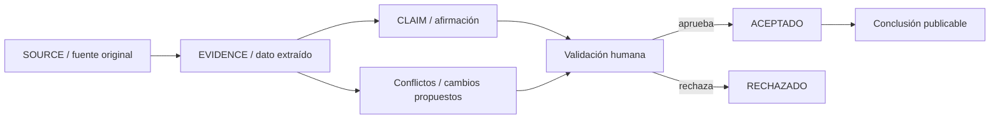
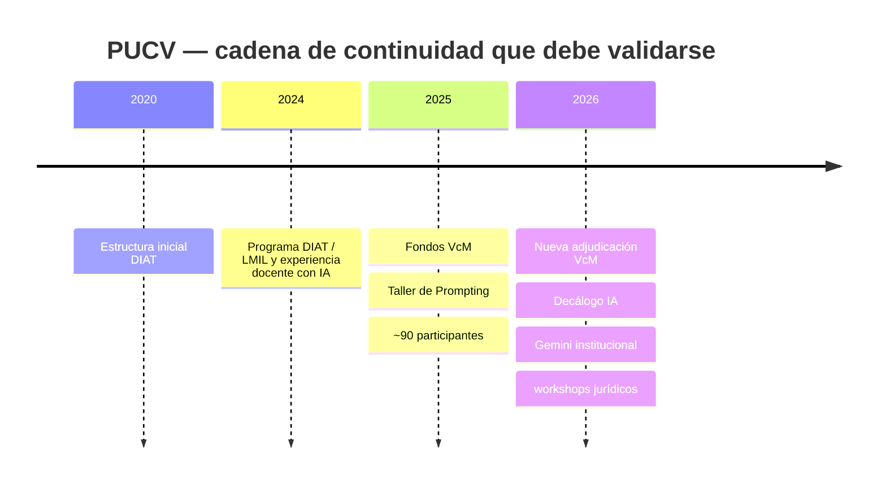

# Informe de avance de investigación — IA y Derecho en universidades chilenas, corte septiembre de 2026

## Resumen ejecutivo y control de versión

**Carácter del documento:** documento de trabajo no oficial; levantamiento de evidencias y propuestas de actualización. **Ningún registro nuevo se considera `ACEPTADO` en esta entrega.**

| Campo canónico | Valor |
|---|---|
| Versión de cohorte | `COHORTE_IA_DERECHO_CHILE_11_V1` |
| Protocolo de trabajo | `METODOLOGIA_IA_DERECHO_V2.0` |
| Fecha de corte | **1 de septiembre de 2026** |
| Modelo utilizado | **GPT-5.5 Thinking** |
| Fecha de ejecución | **1 de septiembre de 2026** |
| Instituciones revisadas | `puc-chile`, `uchile`, `udp`, `uandes`, `uai`, `unab`, `udd`, `uautonoma`, `ucentral`, `pucv`, `udec` |
| Cobertura de cohorte | **11/11 instituciones**, barrido inicial de actualización; no equivale todavía a cierre exhaustivo |
| Estado de integración | **DETENIDA PARA ACEPTACIÓN CANÓNICA** por conflicto documental descrito más abajo; investigación y creación de registros `PROPUESTO/FUENTE_ABIERTA/CONTRASTADO` sí continúan |
| Fecha común de consulta web | **01-09-2026** |

El principal resultado del levantamiento es que **el panorama de septiembre de 2026 es materialmente distinto del que sugiere el informe heredado**. El cambio más visible no es simplemente un aumento de charlas: varias facultades han creado estructuras, reglas o mecanismos de adopción más formales. Derecho UC creó un **Departamento de Derecho y Tecnología** y, en agosto de 2026, una guía específica para el uso de IA generativa por sus estudiantes; la UDP creó una **Dirección de Inteligencia Artificial y Derecho** con mandato explícitamente curricular; la Universidad Autónoma informa alfabetización en IA generativa cercana al **80 % de su cuerpo docente de Derecho** y comenzó un programa de 18 semanas para estudiantes de Clínicas Jurídicas; la Universidad Central presenta actualmente un **Programa de IA & LegalTech**; y la PUCV muestra continuidad del **Programa DIAT y LMIL**, con adjudicación de fondos universitarios de Vinculación con el Medio tanto en 2025 como en 2026. citeturn16search10turn16search6turn12search0turn14search14turn14search12turn14search18turn14search0turn14search5

También aparecen capacidades de **IA aplicada directamente a la formación o práctica jurídica** que no deben confundirse con mera discusión doctrinal. UNAB reportó un asistente de IA generativa dentro de Canvas para tres asignaturas de primer ciclo de Derecho y lanzó con la Superintendencia de Insolvencia y Reemprendimiento un asesor virtual de insolvencia basado en IA; UDD documentó el proyecto estudiantil LegalTech **Hereda Fácil**, que utiliza IA para posesiones efectivas intestadas; y la Universidad Autónoma inició en agosto de 2026 un programa de IA aplicada al trabajo de sus clínicas en las tres sedes. citeturn17search0turn17search1turn18search0turn14search12

En **Derecho aplicado a la IA**, la evidencia también se fortalece. UAI adjudicó en 2026 un Fondecyt Regular dirigido por Ricardo Lillo sobre debido proceso en la era de la inteligencia artificial; su Laboratorio de Justicia Centrada en las Personas volvió a impartir “Inteligencia Artificial y Justicia” para la Academia Judicial. Derecho UC consolidó estructuras dedicadas a tecnología, y CE3 de la Universidad de Chile mantiene una agenda institucional de investigación, docencia y vinculación sobre tecnologías digitales, con actividades específicas en 2026 sobre IA, propiedad intelectual y regulación. citeturn18search3turn18search4turn16search10turn13search16turn13search6

La **hipótesis estratégica sobre la PUCV debe matizarse**. La evidencia pública ya no permite describirla simplemente como un conjunto de iniciativas inconexas: existe una continuidad organizacional identificable —primero Núcleo y actualmente Programa DIAT—, LMIL, liderazgo formal, financiamiento competitivo repetido en 2025 y 2026, actividades con participación documentada y una conexión de Derecho con la gobernanza universitaria de IA mediante la profesora Claudia Poblete. Además, desde marzo de 2026 la Universidad ofrece Gemini dentro de su entorno institucional. citeturn14search0turn14search3turn14search5turn14search2turn14search10 **Pero sigue sin localizarse, en esta ronda, evidencia pública suficiente de una línea curricular obligatoria o transversal en Derecho, dotación estable identificable, presupuesto basal propio, adopción cuantificada de IA dentro de la Facultad ni evaluación pública de resultados de aprendizaje o impacto.** Por ello, la formulación de trabajo más fiel es: `CLM26-PUCV-001-PROPUESTO`: *“La PUCV posee una capacidad organizativa emergente y más persistente de lo que mostraba el antecedente anterior, pero la evidencia pública todavía no demuestra una institucionalización curricular, financiera y evaluativa completa.”* La inferencia se sostiene en las evidencias anteriores y **no es aún una conclusión `ACEPTADA`**. citeturn14search0turn14search3turn14search5turn14search2turn14search10

Finalmente, el informe heredado **no puede utilizarse como base numérica**. Además de ser un antecedente no verificado, contiene inconsistencias aritméticas, mezcla tecnologías adyacentes con IA y atribuye en algunos casos a Derecho capacidades que pertenecen a otras unidades universitarias. fileciteturn0file1 Los puntajes anteriores quedan, por tanto, fuera de la nueva matriz hasta que las evidencias hayan sido reconstruidas y validadas.

## Control metodológico, auditoría del antecedente y conflicto de integración

El documento metodológico cargado anteriormente ordenaba construir un universo nacional más amplio y utilizar inicialmente PUCV, UC y Universidad de Chile como piloto; incluso indicaba expresamente no limitar la investigación a las once instituciones. fileciteturn0file0 El manifiesto más reciente del usuario, en cambio, establece una **cohorte longitudinal cerrada de once universidades**, prohíbe agregar, eliminar o renombrar instituciones y dispone que las instituciones externas sólo sean registradas como `CANDIDATA_FUERA_DE_COHORTE`.

Esto se registra como:

| conflict_id | Conflicto | Tratamiento de esta entrega |
|---|---|---|
| `CONF-SEP26-001` | Instrucción anterior de universo nacional abierto/piloto de tres frente a decisión humana actual de cohorte cerrada `COHORTE_IA_DERECHO_CHILE_11_V1`. | **No integrar registros al expediente aceptado hasta resolver documentalmente la versión del protocolo.** Para el levantamiento provisional prevalece la decisión humana explícita más reciente: se revisan exactamente las 11 instituciones canónicas y ninguna externa ingresa a comparaciones. |
| `CONF-SEP26-002` | El documento tratado como “informe anterior/2025” contiene actividades fechadas en 2026 e incluso ofertas posteriores al corte del 01-09-2026, por lo que no constituye una fotografía temporal congelada de 2025. | Las etiquetas “nuevo desde 2025” se consideran **provisionales**. Debe reconstruirse el baseline histórico desde versiones/changelog o desde las fechas de las fuentes originales. fileciteturn0file1 |

La segunda observación es especialmente importante. El antecedente heredado incluye, dentro de sus fichas, actividades de abril, junio, agosto y septiembre de 2026. Por consiguiente, una comparación mecánica “informe anterior versus septiembre de 2026” mezclaría cambios reales con incorporaciones realizadas retrospectivamente en el propio archivo. fileciteturn0file1

La auditoría aritmética confirma que tampoco pueden reutilizarse sus totales:

| Institución | Cálculo a partir de las cinco puntuaciones declaradas | Total escrito en el antecedente | Resultado de auditoría |
|---|---:|---:|---|
| `uai` | 0 + 1,5 + 3 + 3 + 0 = **7,5** | **6,2** | Error aritmético |
| `unab` | 2 + 1 + 1 + 1,75 + 2 = **7,75** | **8,75** | Error aritmético |
| `ucentral` | 1 + 1,25 + 3 + 0,75 + 2 = **8,0** | **8,5** | Error aritmético |
| `udp` — I+D | ítems 0,5 + 0,25 + 0,25 = **1,0** | encabezado **0,75** | Inconsistencia interna |

Todos estos valores provienen del propio documento heredado. fileciteturn0file1 Además, su modelo mezclaba dos lógicas distintas: puntuaciones holísticas de 0–3 por dimensión y microponderaciones de 0,25–1,50 por actividad, sin una regla suficientemente determinada para deduplicar iniciativas, controlar dependencia entre actividades o evitar que cantidad de eventos se confundiera con institucionalización. fileciteturn0file1

Por ello se adopta para esta ronda la siguiente escala documental de trabajo, compatible con la nueva rúbrica pero **sin transformarla todavía en puntajes canónicos**:

| Nivel | Interpretación usada en esta entrega |
|---|---|
| `E1` | Señal: evento, noticia, actividad individual o anuncio puntual. |
| `E2` | Operación: curso impartido, herramienta implementada, actividad recurrente, piloto en funcionamiento o producto entregado. |
| `E3` | Institucionalización: estructura formal, política, responsable definido, integración curricular, financiamiento formal, convenio operativo o continuidad inequívoca. |
| `E4` | Evaluación: resultados o efectos públicamente evaluados y revisables, más allá de contar participantes o actividades. |

**No se asigna `E4` a ninguna institución en este barrido.** Se encontraron métricas de cobertura —por ejemplo, 80 % del profesorado de Derecho en la Autónoma, cerca de 90 participantes en el taller PUCV o más de 800 participantes en el Congreso de la Universidad de Chile—, pero esas cifras son productos/cobertura y no equivalen por sí mismas a evaluación pública del efecto de la IA sobre aprendizaje, práctica jurídica, acceso a justicia o productividad. citeturn14search14turn14search3turn8search10

La arquitectura de validación que se mantiene es:

Esta separación reproduce el principio del expediente aportado: una fuente no es una afirmación y una afirmación propuesta no puede pasar directamente a una conclusión publicada. fileciteturn0file0

## Evidencia institucional actualizada

Las tablas siguientes son **registros propuestos**. Los identificadores `LEGACY25-*` son handles de trabajo creados exclusivamente para enlazar evidencias con entradas del informe heredado, porque aquel documento no contiene IDs canónicos de registro. No deben confundirse con IDs aceptados del expediente. fileciteturn0file1

**`puc-chile` — Pontificia Universidad Católica de Chile**

| evidence_id | Evidencia, eje y estado temporal | Fuente original | Responsable | Nivel / estado propuesto | Relación con antecedente |
|---|---|---|---|---|---|
| `EVD26-PUC-001` | **Estructura:** Departamento de Derecho y Tecnología formalizado el 31-12-2025; en 2026 continúa identificado como departamento de la Facultad. `AMBOS`. Activo. | `SRC26-PUC-001`, Derecho UC, 31-12-2025, [URL oficial](https://derecho.uc.cl/derecho-uc-formaliza-la-creacion-del-primer-departamento-de-derecho-y-tecnologia-en-chile/), cons. 01-09-2026. La continuidad de Raúl Madrid como director aparece en actividad de abril de 2026. citeturn16search10turn16search4 | Raúl Madrid | `E3` / `CONTRASTADO` | **NUEVO/AMPLÍA** `LEGACY25-PUC-RD`: el antecedente tenía el Programa Derecho, Ciencia y Tecnología, pero no este departamento formal. |
| `EVD26-PUC-002` | **Política:** Facultad establece “Guía Ética para el uso de Inteligencia Artificial Generativa”, con reglas para estudiantes y subordinación del uso a objetivos del curso y directrices docentes. `IA_PARA_DERECHO`. Vigente al corte. | `SRC26-PUC-002`, Facultad de Derecho UC, 21-08-2026, [URL oficial](https://derecho.uc.cl/facultad-de-derecho-uc-establece-guia-etica-para-uso-de-inteligencia-artificial-generativa/), cons. 01-09-2026. citeturn16search6 | Facultad de Derecho UC / docentes responsables de curso | `E3` / `FUENTE_ABIERTA` | **NUEVO**. Afecta la antigua caracterización del uso interno basada sólo en herramientas generales. |
| `EVD26-PUC-003` | **Formación continua:** se verificó ejecución real del Diplomado en Derecho e Inteligencia Artificial: la cohorte 2025 terminó y tuvo ceremonia de graduación el 14-01-2026. `AMBOS`. | `SRC26-PUC-003`, Programa Derecho, Ciencia y Tecnología UC, 16-01-2026, [URL oficial](https://derechocienciaytecnologia.uc.cl/2026/01/16/graduacion-de-la-generacion-2025-de-los-diplomados-del-programa-de-derecho-ciencia-y-tecnologia-uc/), cons. 01-09-2026. La página vigente sigue mostrando el diplomado y curso de Derecho e IA. citeturn16search15turn16search11 | Matías Aránguiz; Sebastián Dueñas en la cohorte informada | `E2` / `CONTRASTADO` | **CONFIRMA Y ACTUALIZA** `LEGACY25-PUC-FC-DIPIA`: deja de ser sólo una oferta anunciada. |

**Lectura provisional:** el cambio estructural de mayor importancia es la coexistencia de **Departamento + Programa + guía de IA**, que es una señal de institucionalización bastante más fuerte que una colección de actividades independientes. No se localizó, sin embargo, una evaluación pública de efectos equivalente a `E4`. citeturn16search10turn16search0turn16search6

**`uchile` — Universidad de Chile**

| evidence_id | Evidencia, eje y estado temporal | Fuente original | Responsable | Nivel / estado propuesto | Relación con antecedente |
|---|---|---|---|---|---|
| `EVD26-UCH-001` | **Centro/investigación:** CE3 puso en marcha en 2026 un Programa de Visitas Académicas latinoamericano, con estadías de 4–6 semanas, colaboración en proyectos/publicaciones/cursos y vínculos con actores públicos, privados y sociedad civil. `AMBOS`. | `SRC26-UCH-001`, Facultad de Derecho UChile, 02-04-2026, [URL oficial](https://derecho.uchile.cl/noticias/238418/ce3-convoca-a-programa-de-visitas-academicas-de-america-latina-y-el-caribe), cons. 01-09-2026. citeturn13search16 | Alberto Cerda, director CE3 | `E3` / `FUENTE_ABIERTA` | **ACTUALIZA** `LEGACY25-UCH-CE3`: aporta evidencia de actividad e internacionalización vigentes. |
| `EVD26-UCH-002` | **Investigación/vinculación:** CE3 organizó encuentro específico sobre excepción de derecho de autor para formación de sistemas de IA. `DERECHO_DE_IA`. | `SRC26-UCH-002`, Facultad de Derecho UChile, actividad 16-06-2026, [URL oficial](https://derecho.uchile.cl/agenda/241228/consideraciones-para-una-excepcion-de-derechos-de-autor-en-la), cons. 01-09-2026. citeturn13search6 | CE3 | `E1` / `FUENTE_ABIERTA` | **CONFIRMA CONTINUIDAD** del eje Derecho–tecnología/IA. |
| `EVD26-UCH-003` | **Vinculación de escala:** el III Congreso Chileno de Derecho y Tecnología, organizado por CE3 en mayo de 2026, reunió más de 800 asistentes, alrededor de 30 paneles y un centenar de especialistas. `AMBOS`. | `SRC26-UCH-003`, Facultad de Derecho UChile, 19-05-2026, cons. 01-09-2026. citeturn8search10 | CE3 | `E2` / `FUENTE_ABIERTA` | **ACTUALIZA** la secuencia de congresos que el informe heredado ya identificaba. |

**Corrección metodológica:** no se reutiliza el antiguo `Uso interno de IA = 0`. En esta ronda **no se localizó evidencia pública específica de adopción interna de IA dentro de Derecho UChile**, lo que se registra como “no encontrado”, no como inexistencia. La capacidad institucional del CE3, en cambio, está claramente documentada. citeturn13search16turn16search7

**`udp` — Universidad Diego Portales**

| evidence_id | Evidencia, eje y estado temporal | Fuente original | Responsable | Nivel / estado propuesto | Relación con antecedente |
|---|---|---|---|---|---|
| `EVD26-UDP-001` | **Gobernanza/currículo:** la Facultad creó una **Dirección de Inteligencia Artificial y Derecho**, concebida como espacio para decisiones de innovación curricular y pedagógica; la presentación institucional anuncia trabajo desde primer semestre, un taller de IA en escritura legal y formación posterior sobre tecnología/IA en la profesión. `IA_PARA_DERECHO`. | `SRC26-UDP-001`, Facultad de Derecho UDP, 12-09-2025, [URL oficial](https://derecho.udp.cl/academico-rafael-mery-es-nombrado-director-de-inteligencia-artificial-y-derecho-udp/), página de la [Dirección](https://derecho.udp.cl/direccion-de-inteligencia-artificial-y-derecho/), cons. 01-09-2026. La dirección sigue figurando en el Consejo de Facultad. citeturn12search0turn12search9turn12search12 | Rafael Mery | `E3` / `CONTRASTADO` | **SUSTITUCIÓN NOMINAL PROPUESTA:** donde el antecedente hablaba de “Centro de Inteligencia Artificial y Derecho”, la fuente oficial vigente identifica una **Dirección**. |
| `EVD26-UDP-002` | **Formación continua:** curso “Inteligencia Artificial y Derecho”, con inicio informado el 30-04-2026 y modalidad sincrónica online. `AMBOS`. | `SRC26-UDP-002`, fuente oficial UDP de postgrados, cons. 01-09-2026. citeturn0search7 | Facultad de Derecho; dirección académica informada: Ximena Rojas | `E2` / `FUENTE_ABIERTA` | **CONFIRMA/ACTUALIZA** `LEGACY25-UDP-FC-IA`. |
| `EVD26-UDP-003` | **I+D/transferencia:** en abril de 2026 Facultad de Derecho y Vicerrectoría de Investigación firmaron colaboración I+D+i con Quantico SpA y Merlín Research para investigación aplicada, desarrollo tecnológico y transferencia en IA. | `SRC26-UDP-003`, Universidad Diego Portales, 07-04-2026, cons. 01-09-2026. citeturn0search10 | Facultad de Derecho + Vicerrectoría de Investigación | `E3` / `FUENTE_ABIERTA` | **NUEVO** respecto del inventario heredado. |

La evidencia de la Dirección es especialmente relevante porque el mandato formal no se limita a estudiar regulación de IA: apunta a **incorporar el uso de herramientas al aprendizaje y al currículo jurídico**. La ejecución efectiva y cobertura de todos los cambios curriculares anunciados todavía debe verificarse con programas de curso y registros académicos 2026. citeturn12search0turn12search9

**`uandes` — Universidad de los Andes**

| evidence_id | Evidencia, eje y estado temporal | Fuente original | Responsable | Nivel / estado propuesto | Relación con antecedente |
|---|---|---|---|---|---|
| `EVD26-UAND-001` | **Formación continua:** curso de Facultad de Derecho “Compliance, ética pública y nuevas tecnologías”, iniciado 05-08-2026; incluye explícitamente problemas de legalidad y control en la implementación de IA por la Administración. `DERECHO_DE_IA`. | `SRC26-UAND-001`, Postgrados UANDES, [URL oficial](https://postgrados.uandes.cl/cursos/curso-en-compliance-etica-publica-y-nuevas-tecnologias/), pub. no especificado, cons. 01-09-2026. citeturn15search3 | Facultad de Derecho | `E2` / `FUENTE_ABIERTA` | **ACTUALIZA** oferta formativa heredada. |
| `EVD26-UAND-002` | **Proyecto aplicado:** UANDES y PUCV desarrollan/validan una plataforma basada en IA para aumentar certeza jurídica en evaluación ambiental, respaldada por FONDEF; la fuente describe un equipo interfacultades e interuniversitario de derecho, ingeniería, lingüística y ciencias ambientales. `IA_PARA_DERECHO`. | `SRC26-UAND-002`, Investiga UANDES, 05-11-2025, [URL oficial](https://investiga.uandes.cl/es/investigacion-aplicara-ia-para-agilizar-la-evaluacion-ambiental-de-proyectos-en-chile/), cons. 01-09-2026. citeturn15search17 | Carla Vairetti lidera el proyecto; equipo interdisciplinario | `E3` / `FUENTE_ABIERTA` | **CONFIRMA** la pista heredada, pero debe precisarse la participación exacta de la Facultad de Derecho en la fase vigente. |
| `EVD26-UAND-003` | **Derecho de IA:** seminario de Facultad de Derecho sobre uso de obras por sistemas de IA generativa y excepción de minería de datos, 14-05-2026. | `SRC26-UAND-003`, UANDES, 14-05-2026, [URL oficial](https://postgrados.uandes.cl/seminarios/seminario-el-uso-de-obras-ajenas-por-los-sistemas-de-inteligencia-artificial-generativa-hacia-una-nueva-excepcion-de-los-derechos-de-autor/), cons. 01-09-2026. citeturn15search4 | Facultad de Derecho; Manuel Bernet y panel | `E1` / `FUENTE_ABIERTA` | **NUEVO/ACTUALIZA** actividad temática. |

**Corrección propuesta:** el convenio universitario con Red AIGEN/Tecnológico de Monterrey citado anteriormente no debe acreditarse automáticamente a Derecho. La evidencia disponible describe un piloto universitario con docentes, pero el antecedente no demostró participación concreta de la Facultad de Derecho. Se propone mantenerlo fuera del puntaje específico de la unidad hasta verificar esa participación. fileciteturn0file1

**`uai` — Universidad Adolfo Ibáñez**

| evidence_id | Evidencia, eje y estado temporal | Fuente original | Responsable | Nivel / estado propuesto | Relación con antecedente |
|---|---|---|---|---|---|
| `EVD26-UAI-001` | **Investigación:** Ricardo Lillo, Facultad de Derecho, obtuvo Fondecyt Regular 2026 para investigar el derecho al debido proceso en la era de la IA. `DERECHO_DE_IA`. | `SRC26-UAI-001`, UAI, 29-01-2026, [URL oficial](https://www.uai.cl/noticias/derecho/ricardo-lillo-esteban-pereira-y-javier-wilenmann-se-adjudican-proyectos-fondecyt-regular-2026), cons. 01-09-2026. citeturn18search3 | Ricardo Lillo | `E3` / `FUENTE_ABIERTA`; pendiente cotejo con ANID | **NUEVO:** evidencia específica de Derecho, más sólida para esta investigación que GobLab. |
| `EVD26-UAI-002` | **Transferencia/formación judicial:** Laboratorio de Justicia Centrada en las Personas impartió nuevamente “Inteligencia Artificial y Justicia” a la Academia Judicial, incluyendo IA generativa, machine learning, sesgos, transparencia y debido proceso; el curso se enmarca en un acuerdo de 2025. `AMBOS`. | `SRC26-UAI-002`, UAI, 22-04-2026, [URL oficial](https://www.uai.cl/noticias/derecho/laboratorio-de-justicia-centrada-en-las-personas-uai-dicta-curso-de-ia-para-la-academia-judicial), cons. 01-09-2026. citeturn18search4 | Ricardo Lillo; Esteban Ruiz | `E3` / `FUENTE_ABIERTA` | **NUEVO/ACTUALIZA**; evidencia de recurrencia y convenio. |
| `EVD26-UAI-003` | **Convenio LegalTech:** Facultad de Derecho firmó cooperación con **Legu**, plataforma que usa IA para acceso a información/servicios jurídicos y herramientas para profesionales. `IA_PARA_DERECHO`. | `SRC26-UAI-003`, UAI, 12-01-2026, [URL oficial](https://alumni.uai.cl/news/noticias-uai/905/905-Facultad-de-Derecho-firma-convenio-con-Legu-legaltech-que-impulsa-el-acceso-al-derecho-mediante-IA), cons. 01-09-2026. citeturn18search1 | Facultad de Derecho; Laboratorio de Justicia Centrada en las Personas; Legu | `E3` / `FUENTE_ABIERTA` | **NUEVO**. |

Aquí aparece una corrección relevante al informe anterior: **GobLab es una capacidad universitaria importante, pero no debe convertirse automáticamente en capacidad de la Facultad de Derecho**. El nuevo levantamiento permite sustituir ese atajo por evidencia propiamente jurídica: Laboratorio de Justicia, Fondecyt sobre IA y debido proceso, curso para Academia Judicial y convenio Legu. citeturn18search3turn18search4turn18search1

**`unab` — Universidad Andrés Bello**

| evidence_id | Evidencia, eje y estado temporal | Fuente original | Responsable | Nivel / estado propuesto | Relación con antecedente |
|---|---|---|---|---|---|
| `EVD26-UNAB-001` | **Adopción docente:** la Cuenta Pública de Derecho informa implementación de un asistente de IA generativa en Canvas en **Introducción al Derecho, Derecho de los Bienes y Teoría de los Derechos y Acciones Constitucionales**. `IA_PARA_DERECHO`. Implementado durante 2025 y reportado en 2026. | `SRC26-UNAB-001`, UNAB, 01-03-2026, [URL oficial](https://noticias.unab.cl/facultad-de-derecho-unab-presento-su-cuenta-publica-2025-con-foco-en-innovacion-internacionalizacion-y-fortalecimiento-academico/), cons. 01-09-2026. citeturn17search0 | Facultad de Derecho UNAB | `E2` / `FUENTE_ABIERTA` | **CONFIRMA Y PRECISA** la antigua afirmación sobre asistentes especializados: ahora hay cursos identificados. |
| `EVD26-UNAB-002` | **Proyecto aplicado/acceso a justicia:** Facultad de Derecho + Transferencia Tecnológica + Superintendencia de Insolvencia lanzaron un asesor virtual de insolvencia basado en IA generativa. `IA_PARA_DERECHO`. | `SRC26-UNAB-002`, UNAB, 27-10-2025, [URL oficial](https://noticias.unab.cl/unab-lanzo-asesor-virtual-de-insolvencia/), cons. 01-09-2026. citeturn17search1 | Facultad de Derecho; Dirección de Transferencia Tecnológica; Superintendencia | `E3` / `FUENTE_ABIERTA` | **CONFIRMA** `LEGACY25-UNAB-IAD-INSOLV`. |
| `EVD26-UNAB-003` | **Capacidad institucional habilitante:** durante el segundo semestre de 2026 UNAB inició implementación progresiva de `MIAsistentes`, ecosistema institucional de asistentes virtuales académicos y de servicio. Es universidad-wide; no se atribuye adicionalmente a Derecho sin datos de aplicación específica aparte de `EVD26-UNAB-001`. | `SRC26-UNAB-003`, UNAB, 31-08-2026, [URL oficial](https://noticias.unab.cl/unab-impulsa-miasistentes-un-ecosistema-de-inteligencia-artificial-para-acompanar-el-aprendizaje-y-la-experiencia-universitaria/), cons. 01-09-2026. citeturn17search6 | Vicerrectoría de Transformación Digital y unidades centrales | `E2` / `FUENTE_ABIERTA` | **NUEVO, ADYACENTE/HABILITANTE**. |

Se propone, en cambio, **dejar de contar el Tribunal Virtual/metaverso como IA por sí mismo**. La fuente oficial describe realidad virtual, simulación, protocolos y evaluación, pero no acredita que la IA sea un componente sustantivo de ese sistema. Bajo la definición actual debe quedar `ADYACENTE` salvo nueva prueba. citeturn17search4

**`udd` — Universidad del Desarrollo**

| evidence_id | Evidencia, eje y estado temporal | Fuente original | Responsable | Nivel / estado propuesto | Relación con antecedente |
|---|---|---|---|---|---|
| `EVD26-UDD-001` | **Currículo:** la página vigente de la nueva malla de Derecho anuncia integración de `LEGALTECH + IA` mediante Talleres de Herramientas Digitales e Inteligencia Artificial en Derecho y Análisis de Datos e Investigación Jurídica. `IA_PARA_DERECHO`. | `SRC26-UDD-001`, Facultad de Derecho UDD, página vigente, fecha pub. no especificada, [URL oficial](https://derecho.udd.cl/carrera/derecho/), cons. 01-09-2026. La página está actualmente rotulada para Admisión 2027, aunque el sitio de malla también referencia “derecho malla 2026”. citeturn19search2turn19search0 | Facultad de Derecho UDD | `E2` / `FUENTE_ABIERTA` | **CONFIRMA PARCIALMENTE** la pista anterior, pero **queda pendiente determinar qué cohortes 2026 ya cursan efectivamente los talleres**. |
| `EVD26-UDD-002` | **Proyecto estudiantil LegalTech:** `Hereda Fácil`, desarrollado por un estudiante de Derecho y uno de Ingeniería Civil Informática, usa IA para facilitar posesiones efectivas intestadas y fue reconocido en Incuba UDD. `IA_PARA_DERECHO`. | `SRC26-UDD-002`, Derecho UDD, 30-06-2026, [URL oficial](https://derecho.udd.cl/noticias/2026/06/estudiantes-de-derecho-udd-concepcion-destacan-en-el-cierre-de-una-nueva-edicion-de-incuba-udd/), cons. 01-09-2026. citeturn18search0 | Benjamín Gómez y Benjamín Jara | `E1–E2` / `FUENTE_ABIERTA` | **NUEVO**. Es prototipo/emprendimiento estudiantil, no estructura institucional. |
| `EVD26-UDD-003` | **Investigación/formación doctoral:** workshop del Doctorado en Derecho sobre regulación de IA y necesidad de repensar marcos jurídico-constitucionales frente a avances tecnológicos. `DERECHO_DE_IA`. | `SRC26-UDD-003`, Derecho UDD, 14-01-2026, [URL oficial](https://derecho.udd.cl/noticias/2026/01/workshop-del-doctorado-aborda-los-desafios-regulatorios-de-la-ia-y-el-rol-del-derecho-ante-los-avances-tecnologicos/), cons. 01-09-2026. citeturn19search7 | Doctorado en Derecho; expositor Simone Penasa | `E1` / `FUENTE_ABIERTA` | **NUEVO/ACTUALIZA** la dimensión de posgrado/investigación. |

La nueva malla constituye una señal curricular más importante que un seminario, pero **la página de admisión no basta para probar por sí sola cobertura efectiva de estudiantes de 2026**. Esa distinción debe conservarse antes de asignar un nivel 3 de institucionalización curricular. citeturn19search0turn19search2

**`uautonoma` — Universidad Autónoma de Chile**

| evidence_id | Evidencia, eje y estado temporal | Fuente original | Responsable | Nivel / estado propuesto | Relación con antecedente |
|---|---|---|---|---|---|
| `EVD26-UAUT-001` | **Trayectoria curricular:** estudiantes de Derecho culminaron el Minor en Inteligencia Artificial y Derecho del año académico 2025; la ceremonia fue realizada en enero de 2026. `AMBOS`. | `SRC26-UAUT-001`, U. Autónoma, 09-01-2026, [URL oficial](https://www.uautonoma.cl/noticias/estudiantes-de-derecho-egresan-del-minor-en-inteligencia-artificial-y-derecho/), cons. 01-09-2026. citeturn14search16 | Facultad de Derecho / IA+D | `E3` / `FUENTE_ABIERTA` | **CONFIRMA Y ELEVA** la antigua pista del Minor: existe evidencia de estudiantes que completaron la trayectoria. |
| `EVD26-UAUT-002` | **Adopción docente:** la Facultad informa una decena de talleres de alfabetización en IA generativa, cobertura cercana al **80 % de docentes de Derecho** en Santiago, Talca y Temuco y extensión progresiva a estudiantes. `IA_PARA_DERECHO`. | `SRC26-UAUT-002`, U. Autónoma, 27-05-2026, [URL oficial](https://www.uautonoma.cl/noticias/alfabetizacion-en-ia-generativa-en-derecho-alcanza-al-80-de-docentes-y-se-amplia-a-estudiantes/), cons. 01-09-2026. citeturn14search14 | Ricardo Torres, Valeska Rivas, Sebastián Bozzo | `E3` / `FUENTE_ABIERTA` | **NUEVO**. Afecta directamente la antigua caracterización de “uso interno 0”. |
| `EVD26-UAUT-003` | **Clínicas jurídicas:** el 10-08-2026 comenzó “Inteligencia Artificial Aplicada a la Práctica Clínica Jurídica”, 18 semanas, para estudiantes diurnos y vespertinos de las Clínicas en las tres sedes; incluye prompting jurídico, análisis documental, automatización y agentes especializados. `IA_PARA_DERECHO`. | `SRC26-UAUT-003`, U. Autónoma, 10-08-2026, [URL oficial](https://www.uautonoma.cl/noticias/facultad-de-derecho-pone-en-marcha-innovador-programa-de-formacion-en-inteligencia-artificial-para-estudiantes-de-sus-clinicas-juridicas/), cons. 01-09-2026. citeturn14search12 | Facultad de Derecho y profesores de Clínica | `E3` / `FUENTE_ABIERTA` | **NUEVO** y materialmente relevante para pregrado/práctica. |

La ficha heredada requiere una **revisión profunda**. No sólo debe abandonarse su `Uso interno = 0`; también conviene normalizar la nomenclatura del antiguo “Centro IA+D”. La documentación oficial utiliza, según la página, **Grupo de Investigación IA+D / Minor IA y Derecho**, por lo que “Centro” no debe mantenerse sin resolución o fuente que acredite esa categoría institucional. La existencia del proyecto/grupo es real, pero su tipo de entidad debe quedar exactamente como figure en los documentos oficiales. fileciteturn0file1

**`ucentral` — Universidad Central de Chile**

| evidence_id | Evidencia, eje y estado temporal | Fuente original | Responsable | Nivel / estado propuesto | Relación con antecedente |
|---|---|---|---|---|---|
| `EVD26-UCEN-001` | **Estructura:** la Facultad mantiene una página oficial del **Programa de IA & LegalTech**, cuya misión declarada integra investigación aplicada, productos I+D, educación avanzada e innovación tecnológica. La Cuenta Pública de la Facultad documenta que en 2026 la antigua Cátedra LegalTech fue transformada formalmente en el nuevo programa. `AMBOS`. | `SRC26-UCEN-001`, FACDEH UCentral, página vigente, pub. no especificada, [URL oficial](https://facdeh.ucentral.cl/legal-tech/), cons. 01-09-2026. citeturn14search18turn4search1 | Programa IA & LegalTech; dirección informada institucionalmente: Gonzalo Álvarez | `E3` / `CONTRASTADO` | **SUSTITUYE/ACTUALIZA** `LEGACY25-UCEN-CATEDRA`: Cátedra LegalTech → Programa IA & LegalTech. |
| `EVD26-UCEN-002` | **Publicación/investigación:** tercer número de Revista DIE del Doctorado en Derecho incluyó editorial sobre responsabilidad algorítmica y trabajos relativos a IA, datos y derechos fundamentales. `DERECHO_DE_IA`. | `SRC26-UCEN-002`, UCentral, 25-08-2026, [URL oficial](https://noticias.ucentral.cl/noticias/inteligencia-artificial-derechos-fundamentales-revista-die/), cons. 01-09-2026. citeturn14search20 | Doctorado en Derecho / Facultad; editorial del decano Rafael Pastor | `E2` / `FUENTE_ABIERTA` | **NUEVO/ACTUALIZA** producción académica. |
| `EVD26-UCEN-003` | **Política institucional habilitante:** la Universidad trabajó durante 2026 en una política institucional de integración de IA. Se conserva como evidencia universitaria; su aplicación específica y resultados en Derecho requieren verificación separada. | `SRC26-UCEN-003`, Universidad Central, 19-01-2026, cons. 01-09-2026. citeturn4search15 | Universidad Central | `E2–E3` / `FUENTE_ABIERTA` | **NUEVO, ADYACENTE/HABILITANTE**; no se acredita automáticamente como política específica de Derecho. |

Los antiguos registros sobre `iLex` e `IDEA UCEN` **no se arrastran todavía como vigentes**: requieren revalidación directa de su operación al 01-09-2026. El nuevo Programa IA & LegalTech sí está públicamente visible y constituye una actualización estructural verificable. citeturn14search18

**`pucv` — Pontificia Universidad Católica de Valparaíso**

| evidence_id | Evidencia, eje y estado temporal | Fuente original | Responsable | Nivel / estado propuesto | Relación con antecedente |
|---|---|---|---|---|---|
| `EVD26-PUCV-001` | **Estructura + recursos:** Facultad y Escuela, a través de LMIL y el **Programa Derecho, Inteligencia Artificial y Tecnología (DIAT)**, obtuvieron fondos VcM 2026 para Innova Day y Taller de IA y Prompting Jurídico. `AMBOS`. | `SRC26-PUCV-001`, Derecho PUCV, 03-06-2026, [URL oficial](https://www.pucv.cl/uuaa/derecho-pucv/noticias/facultad-y-escuela-de-derecho-pucv-se-adjudican-dos-proyectos-de), cons. 01-09-2026. La adjudicación repite financiamiento obtenido en 2025. citeturn14search0turn14search5 | Adolfo Silva Walbaum; LMIL y Programa DIAT | `E3` / `CONTRASTADO` | **ACTUALIZA Y CORRIGE NOMENCLATURA** `LEGACY25-PUCV-DIAT`: en 2026 la fuente oficial habla de **Programa**, no de “Centro DIAT”. |
| `EVD26-PUCV-002` | **Continuidad/formación aplicada:** el Taller de Prompting 2025 se ejecutó en tres sesiones, dirigido principalmente a estudiantes de Derecho y reunió cerca de 90 participantes; el financiamiento 2026 prevé nueva actividad de IA y prompting. `IA_PARA_DERECHO`. | `SRC26-PUCV-002`, Derecho PUCV, 07-10-2025, [URL oficial](https://www.pucv.cl/uuaa/derecho-pucv/noticias/destacada-participacion-de-estudiantes-en-la-jornada-de-cierre-del), cons. 01-09-2026; continuidad 2026 en `SRC26-PUCV-001`. citeturn14search3turn14search0 | Programa DIAT + LMIL | `E2–E3` / `CONTRASTADO` | **CONFIRMA CONTINUIDAD**, no sólo evento aislado. |
| `EVD26-PUCV-003` | **Gobernanza docente:** la PUCV presentó en enero de 2026 un Decálogo de uso de IA en docencia con foco en integridad académica; fue elaborado por la Unidad de Integridad Académica y **liderado por Claudia Poblete, profesora de la Escuela de Derecho**. `ADYACENTE`, con participación concreta de Derecho. | `SRC26-PUCV-003`, PUCV, 09-01-2026, [URL oficial](https://www.pucv.cl/pucv/noticias/destacadas/universidad-presento-decalogo-para-el-uso-etico-de-la-inteligencia), cons. 01-09-2026. citeturn14search2 | Unidad de Integridad Académica; Claudia Poblete | `E3` / `FUENTE_ABIERTA` | **NUEVO**. Muestra participación de Derecho en gobernanza universitaria de IA, aunque no constituye política exclusiva de la Facultad. |
| `EVD26-PUCV-004` | **Infraestructura habilitante:** desde marzo de 2026 la PUCV comenzó a habilitar Gemini integrado a Google Workspace para la comunidad académica y administrativa. La fuente demuestra acceso institucional, **no adopción efectiva específica de Derecho**. | `SRC26-PUCV-004`, PUCV, 19-03-2026, [URL oficial](https://www.pucv.cl/pucv/noticias/vida-universitaria/universidad-habilita-herramienta-gemini-ia-para-fortalecer-el-trabajo), cons. 01-09-2026. citeturn14search10 | Universidad / modernización tecnológica | `E2` / `FUENTE_ABIERTA` | **CONTRADICE PARCIALMENTE** el antiguo “uso interno IA: 0”: hay infraestructura institucional disponible, pero falta probar uso en la unidad Derecho. |

Debe incorporarse además como antecedente histórico revalidado que Derecho PUCV había experimentado con **“Prompts Socráticos” en Filosofía del Derecho en 2024**, lo que hace todavía menos sostenible arrastrar mecánicamente la antigua puntuación de cero en uso docente. Esa experiencia, sin evidencia actual de continuidad, se conserva como **histórica**, no como stock 2026. citeturn7search6

La secuencia institucional propuesta queda así:

La línea temporal se reconstruye a partir de documentación institucional que muestra el tránsito de la denominación inicial de Núcleo hacia el actual Programa DIAT, experiencias docentes previas y financiamiento repetido en 2025–2026. citeturn7search2turn7search3turn7search4turn14search5turn14search0turn14search2turn14search10 La nomenclatura exacta de cada periodo debe preservarse y **no retroproyectarse**: “Núcleo”, “Programa” y “Centro” no son sinónimos administrativos.

**`udec` — Universidad de Concepción**

| evidence_id | Evidencia, eje y estado temporal | Fuente original | Responsable | Nivel / estado propuesto | Relación con antecedente |
|---|---|---|---|---|---|
| `EVD26-UDEC-001` | **Formación/vinculación jurídica:** Facultad realizó seminario “Inteligencia Artificial para Abogados: leer, investigar, redactar y argumentar con IA”, con demostraciones de modelos de lenguaje aplicados al trabajo jurídico. `IA_PARA_DERECHO`. | `SRC26-UDEC-001`, Facultad de Ciencias Jurídicas y Sociales, evento 21-04-2026; fecha de publicación no especificada, [URL oficial](https://jur.udec.cl/content/facultad-de-ciencias-jur%C3%ADdicas-y-sociales-udec-realiz%C3%B3-seminario-sobre-inteligencia), cons. 01-09-2026. citeturn13search3 | Facultad; expositor José Aravena López | `E1` / `FUENTE_ABIERTA` | **NUEVO** respecto de la ficha heredada. |
| `EVD26-UDEC-002` | **Adopción docente:** Facultad realizó taller presencial exclusivo para sus académicos sobre uso crítico, responsable y pedagógico de IA generativa en docencia jurídica, evaluación, retroalimentación e investigación. `IA_PARA_DERECHO`. | `SRC26-UDEC-002`, Facultad de Ciencias Jurídicas y Sociales, fecha pub. no especificada, [URL oficial](https://jur.udec.cl/content/facultad-realiz%C3%B3-taller-de-inteligencia-artificial-para-acad%C3%A9micos-y-acad%C3%A9micas), cons. 01-09-2026. citeturn13search20 | Facultad; taller impartido por Rafael Mery | `E2` / `FUENTE_ABIERTA` | **NUEVO**. Es evidencia específica de Derecho que no estaba en el antecedente. |
| `EVD26-UDEC-003` | **Capacidad universitaria:** `[genIA]` es un programa interdisciplinario institucional con roadmap 2026, formación, tecnología y ética. La evidencia acredita una capacidad UdeC transversal, pero **no una estructura de Derecho**. | `SRC26-UDEC-003`, UdeC, 10-02-2026 y roadmap 2026, [URL oficial](https://www.genia.udec.cl/), cons. 01-09-2026. citeturn13search2turn13search13turn13search22 | Programa [genIA] UdeC | `E3` institucional / `FUENTE_ABIERTA`; clasificación `ADYACENTE` para Derecho | **RECLASIFICA** `LEGACY25-UDEC-GENIA`: no debe puntuarse automáticamente como I+D de la Facultad de Derecho. |

La UdeC es un buen ejemplo de por qué la nueva regla de unidad de análisis cambia resultados: existe una estrategia universitaria de IA relativamente estructurada, pero la evidencia específicamente jurídica localizada hasta el corte consiste principalmente en capacitación de profesores y actividades formativas, no en una unidad propia de IA y Derecho. citeturn13search2turn13search20turn13search3

## Comparación transversal y análisis especial de la PUCV

La siguiente matriz **no es un ranking**. Resume únicamente qué tipo de capacidad ha quedado documentada en esta ronda. “No localizada” significa que la búsqueda realizada no produjo evidencia suficiente; **no significa inexistencia**.

| ID | Estructura específica vinculada a Derecho | Pregrado / IA aplicada a aprendizaje jurídico | Investigación o proyecto IA–Derecho | Política/adopción interna verificable | Señal más importante al 01-09-2026 |
|---|---|---|---|---|---|
| `puc-chile` | **Sí:** Departamento + Programa | Integración institucional en desarrollo; no se cierra aún cobertura curricular | Programa activo | **Sí:** guía propia de Facultad | Salto hacia gobernanza formal. citeturn16search10turn16search6 |
| `uchile` | **Sí:** CE3 | Curso específico de pregrado no revalidado en fuente original en esta ronda | **Sí**, centro y agenda sostenida | No localizada para Derecho | Muy fuerte en investigación/vinculación, con III Congreso de gran escala. citeturn13search16turn8search10 |
| `udp` | **Sí:** Dirección de IA y Derecho | **Diseño curricular explícito**; ejecución completa pendiente de documentar | Convenio I+D+i con empresas de IA | Dirección con mandato pedagógico | La IA se formula como competencia profesional y curricular. citeturn12search0turn0search10 |
| `uandes` | No localizada una unidad IA–Derecho dedicada | No localizada | Proyecto FONDEF interdisciplinario con aplicación jurídico-ambiental | No localizada específicamente en Derecho | Desarrollo específico, pero menos articulado públicamente. citeturn15search17turn15search3 |
| `uai` | **Sí:** Laboratorio de Justicia Centrada en las Personas | No localizada integración curricular general | **Sí:** Fondecyt IA y debido proceso | No localizada adopción interna general | Investigación jurídica + transferencia al sistema judicial. citeturn18search3turn18search4 |
| `unab` | No localizada una unidad exclusiva IA–Derecho | **Sí:** IA generativa en tres asignaturas | **Sí:** asesor virtual de insolvencia | **Sí, operacional** en cursos | De los casos más claros de implementación directa en docencia jurídica. citeturn17search0turn17search1 |
| `udd` | No localizada | Nueva malla declara talleres IA; cobertura 2026 pendiente | Proyecto estudiantil LegalTech; actividad doctoral | No localizada | Hay transición desde formación/eventos hacia currículo y prototipado. citeturn19search2turn18search0 |
| `uautonoma` | **Sí:** IA+D / Minor | **Sí:** Minor completado + programa Clínicas | Estructura interdisciplinaria IA+D | **Sí:** alfabetización ~80 % docentes | Evidencia más amplia de despliegue docente dentro de la Facultad en esta ronda. citeturn14search16turn14search14turn14search12 |
| `ucentral` | **Sí:** Programa IA & LegalTech | Implementaciones históricas requieren nueva comprobación | Programa + publicaciones doctorales | Política universitaria en desarrollo; aplicación específica pendiente | Formalización en 2026 de una estructura más amplia que la antigua Cátedra. citeturn14search18turn14search20 |
| `pucv` | **Sí:** Programa DIAT + LMIL | Talleres aplicados; experiencia curricular histórica, no línea obligatoria demostrada | Estructura y proyectos; recursos VcM repetidos | Decálogo con liderazgo de profesora de Derecho + Gemini institucional, sin métrica de uso en Facultad | Más continuidad y recursos que los reconocidos por el antecedente; integración curricular/evaluativa aún no demostrada. citeturn14search0turn14search3turn14search2turn14search10 |
| `udec` | [genIA] es institucional, no específico de Derecho | Taller docente + seminario aplicado | Investigación específica de Facultad no localizada | Capacitación docente específica | La capacidad universitaria general es mayor que la evidencia jurídica propia. citeturn13search20turn13search2 |

Tres patrones provisionales surgen con suficiente fuerza para orientar la siguiente fase.

**Primero, el sistema ya no puede describirse sólo como una acumulación de diplomados y seminarios.** Al menos UC, UDP, Autónoma, UCentral y PUCV presentan hoy estructuras, responsabilidades o programas reconocibles vinculados directamente con Derecho y tecnología/IA; UAI cuenta con un laboratorio jurídico que ejecuta investigación y transferencia vinculada a IA; y UChile mantiene CE3 como estructura consolidada. citeturn16search10turn12search9turn14search16turn14search18turn14search0turn18search4turn13search16

**Segundo, IA aplicada al Derecho comienza a diferenciar mejor a las instituciones que la mera discusión sobre regulación.** UNAB documenta asistentes dentro de cursos; Autónoma incorpora IA a clínicas y formación docente de amplia cobertura; UDP le asigna a su nueva Dirección un mandato curricular; PUCV ha repetido talleres de prompting y financiamiento; y UDD muestra una malla que declara explícitamente LegalTech + IA. citeturn17search0turn14search12turn14search14turn12search0turn14search0turn19search2

**Tercero, la debilidad transversal sigue estando en la evaluación.** La información pública encontrada dice quién organiza, qué curso se ofrece, cuántos profesores fueron capacitados o cuántas personas asistieron; casi nunca informa si cambió el aprendizaje jurídico, la calidad de escritos, los errores, tiempos de trabajo, acceso a justicia, empleabilidad o desempeño profesional. En términos del protocolo, la cohorte muestra varias señales de nivel 2–3, pero todavía no se dispone en este barrido de evidencia suficiente para una banda 4 de evaluación de efectos.

### PUCV: hipótesis estratégica sometida a contraste

La evidencia obliga a separar dos preguntas distintas.

**¿Hay una estructura coherente identificable?** Sí, al menos en un sentido organizacional inicial: las mismas fuentes de Derecho PUCV conectan **Programa DIAT, LMIL, dirección académica identificada, fondos concursables y una secuencia de actividades en más de un año**. Los fondos de Vinculación con el Medio fueron obtenidos en 2025 y nuevamente en 2026; el taller de 2025 fue efectivamente ejecutado en tres sesiones; y la convocatoria 2026 vuelve a financiar IA y prompting jurídico. citeturn14search5turn14search3turn14search0

**¿Está demostrada una capacidad plenamente institucionalizada, transversal, financiada de modo estable y evaluable?** Todavía no. Los fondos localizados son **concursables**, no evidencia de presupuesto basal; las actividades de prompting son extracurriculares; Gemini es una infraestructura de toda la Universidad y no existe en las fuentes revisadas una métrica sobre adopción específica en Derecho; y el Decálogo universitario demuestra participación relevante de una académica de Derecho, pero no equivale a una política propia de la Facultad. citeturn14search0turn14search2turn14search10

Por consiguiente:

`CLM26-PUCV-001-PROPUESTO — INFERENCIA`

> **La hipótesis original queda parcialmente confirmada, pero su formulación inicial subestima la continuidad institucional existente.** La PUCV sí posee una arquitectura reconocible en IA, Derecho e innovación legal; lo que no está demostrado públicamente es el paso desde esa arquitectura de programas, laboratorios, proyectos y fondos concursables a una capacidad curricular transversal, con recursos basales, responsabilidad distribuida, métricas de cobertura y evaluación de resultados.

Cadena de razonamiento: `EVD26-PUCV-001` + `EVD26-PUCV-002` demuestran estructura, continuidad y recursos → `EVD26-PUCV-003` demuestra participación jurídica en gobernanza universitaria → `EVD26-PUCV-004` demuestra infraestructura de IA disponible → ausencia en las fuentes revisadas de currículo obligatorio, presupuesto basal o evaluación pública impide elevar la inferencia a “institucionalización completa”. citeturn14search0turn14search3turn14search2turn14search10

Las comparaciones más incómodas para la PUCV no son, por ahora, las de cantidad de eventos. Son otras: **Derecho UC ya posee una guía específica de Facultad y un departamento formal; la UDP ha asignado un responsable formal a la transformación curricular; Autónoma publica cobertura docente cercana al 80 % y un programa clínico de 18 semanas; UNAB identifica tres cursos jurídicos concretos en los que opera un asistente generativo.** No se ha localizado equivalente público PUCV con ese nivel de especificidad en cobertura curricular o adopción. citeturn16search6turn16search10turn12search0turn14search14turn14search12turn17search0

Esto deja abiertas para PUCV preguntas verificables, no retóricas: **¿qué porcentaje de profesores de Derecho usa IA de manera planificada?, ¿qué asignaturas la incorporan?, ¿qué aprendizajes están definidos?, ¿qué presupuesto basal reciben DIAT y LMIL?, ¿cuántas horas académicas formales sostienen esas unidades?, ¿qué política específica rige trabajos, evaluaciones y datos sensibles jurídicos?, ¿qué resultados produjo el prompting 2025?, ¿qué uso concreto realiza Derecho del acceso institucional a Gemini?** En las fuentes públicas revisadas esas respuestas permanecen **no especificadas**.

## Registro de cambios, contradicciones y afirmaciones afectadas

La siguiente tabla es el núcleo de la auditoría 2025–2026. No modifica registros aceptados; propone operaciones para revisión humana.

| change_id | Institución | Registro/afirmación heredada | Nueva evidencia | Operación propuesta | Afirmaciones afectadas |
|---|---|---|---|---|---|
| `CHG26-001` | `puc-chile` | Capacidad centrada en Programa Derecho, Ciencia y Tecnología. | Departamento formal de Derecho y Tecnología desde 31-12-2025; guía propia IA 21-08-2026. citeturn16search10turn16search6 | `ACTUALIZAR`, sin sobrescribir. | `CLM25-PUC-MADUREZ`; `CLM25-PUC-USO`. |
| `CHG26-002` | `udp` | “Centro de Inteligencia Artificial y Derecho”. | La unidad oficial se denomina **Dirección de Inteligencia Artificial y Derecho**, dirigida por Rafael Mery. citeturn12search0turn12search9 | `SUSTITUIR_NOMENCLATURA_PROPUESTA`. | Ficha de estructura UDP. |
| `CHG26-003` | `udp` | Incorporación de IA en pregrado tratada como actividades aisladas. | La nueva Dirección tiene mandato expreso de innovación curricular desde primer semestre hasta graduación. citeturn12search0 | `ACTUALIZAR`; verificar implementación 2026 antes de nivel 3 curricular. | `CLM25-UDP-PREGRADO`. |
| `CHG26-004` | `uandes` | Red AIGEN computada como capacidad de Derecho/uso institucional. | No se localizó en la fuente universitaria evidencia que identifique participación concreta de Derecho en ese piloto. | `RECLASIFICAR_ADYACENTE` hasta prueba. | `CLM25-UAND-USO`. |
| `CHG26-005` | `uai` | Gran parte de I+D/vinculación atribuida a GobLab. | Existe ahora evidencia específicamente de Derecho: Fondecyt IA/debido proceso, Laboratorio de Justicia, Academia Judicial y Legu. citeturn18search3turn18search4turn18search1 | Separar GobLab como universitario/no-Derecho y crear registros de Facultad propios. | `CLM25-UAI-ID`; `CLM25-UAI-VCM`. |
| `CHG26-006` | `unab` | Clínica/Tribunal del metaverso computado como IA. | La fuente oficial del Tribunal Virtual describe VR/simulación, pero no IA sustantiva. citeturn17search4 | `RECLASIFICAR_ADYACENTE`. | `CLM25-UNAB-PREGRADO`. |
| `CHG26-007` | `unab` | Asistente jurídico de IA descrito de modo general. | Cuenta Pública identifica tres asignaturas concretas. citeturn17search0 | `CONFIRMAR_Y_PRECISAR`. | `CLM25-UNAB-PREGRADO`; `CLM25-UNAB-USO`. |
| `CHG26-008` | `udd` | Taller de IA contado como integración vigente de pregrado. | Página vigente confirma nueva malla LegalTech+IA, pero está presentada actualmente en contexto de Admisión 2027; cobertura de cohortes 2026 requiere documento curricular. citeturn19search0turn19search2 | `MANTENER_PROPUESTO` con estado temporal “implementación no determinada”. | `CLM25-UDD-PREGRADO`. |
| `CHG26-009` | `uautonoma` | Uso interno IA = 0. | Facultad informa ~80 % de docentes capacitados y programa IA en Clínicas de tres sedes. citeturn14search14turn14search12 | `SUPERAR_PROPUESTO` el cero heredado. | `CLM25-UAUT-USO`; `CLM25-UAUT-PREGRADO`. |
| `CHG26-010` | `uautonoma` | “Centro IA+D”. | Fuentes oficiales deben normalizarse a la denominación formal `Grupo/IA+D/Minor` según el registro correspondiente. | `CORREGIR_TIPO_ENTIDAD`, previa resolución/documento constitutivo. | Registro organizacional. |
| `CHG26-011` | `ucentral` | Cátedra LegalTech como estructura principal. | Página vigente y cuenta pública muestran **Programa IA & LegalTech** en 2026. citeturn14search18turn4search1 | `SUSTITUIR_PROPUESTO` conservando la Cátedra como antecedente histórico. | `CLM25-UCEN-ID`; ficha institucional. |
| `CHG26-012` | `pucv` | “Centro de Derecho, Inteligencia Artificial y Tecnología — DIAT”. | En 2026 la unidad es denominada oficialmente **Programa Derecho, Inteligencia Artificial y Tecnología**. citeturn14search0turn14search6 | `SUSTITUIR_NOMENCLATURA_PROPUESTA`; preservar historia Núcleo → Programa. | Registro DIAT y todas las afirmaciones que lo llamen “Centro”. |
| `CHG26-013` | `pucv` | Uso interno IA = 0. | Decálogo 2026 liderado por profesora de Derecho + Gemini institucional + experiencia docente previa con prompts. citeturn14search2turn14search10turn7search6 | `SUPERAR_PROPUESTO` el cero; separar **infraestructura universitaria**, **participación de Derecho** y **uso efectivo de Facultad**. | `CLM25-PUCV-USO`; conclusión estratégica PUCV. |
| `CHG26-014` | `pucv` | Desarrollo caracterizado como esencialmente reciente/incipiente. | Fondos VcM consecutivos 2025–2026 y documentación histórica DIAT muestran continuidad mayor. citeturn14search5turn14search0turn7search3 | `MATIZAR`. | `CLM25-PUCV-MADUREZ`; conclusión global PUCV. |
| `CHG26-015` | `udec` | `[genIA]` contado como I+D de Derecho. | `[genIA]` es explícitamente programa interdisciplinario de toda la Universidad; Derecho tiene actividades propias separadas. citeturn13search2turn13search20 | `RECLASIFICAR_ADYACENTE`; crear evidencias jurídicas específicas aparte. | `CLM25-UDEC-ID`; `CLM25-UDEC-USO`. |
| `CHG26-016` | Todas | Los antiguos ceros se interpretaban como “no existe”. | Protocolo vigente exige distinguir ausencia de evidencia pública de inexistencia. | Sustituir `0 heredado` por nueva búsqueda y rúbrica; no arrastrar ningún cero. | Todas las fichas y comparación global. |

El efecto agregado es importante: **la tabla de puntajes 2025 no debe “actualizarse” agregando o restando décimas**. Debe reconstruirse desde la matriz de evidencias. fileciteturn0file1 De lo contrario, persistirían tres errores conceptuales: adjudicar capacidad de otras facultades a Derecho, tratar tecnologías digitales no-IA como IA y equiparar número de actividades con madurez institucional.

También deben revisarse las antiguas afirmaciones categóricas de “liderazgo”. La evidencia actual permite hablar, con mayor precisión, de **perfiles**: UC presenta fuerte formalización organizativa y normativa; Universidad de Chile, una capacidad consolidada de investigación y vinculación; Autónoma, una expansión notable hacia docencia y clínica; UNAB, aplicación concreta en cursos y herramientas; UAI, investigación y transferencia hacia justicia; UDP, una nueva gobernanza curricular; Central, formalización de programa; y PUCV, continuidad de estructuras y financiamiento concursable todavía con brechas públicas de cobertura y evaluación. Estas son **inferencias provisionales**, no un ranking aceptado. citeturn16search10turn13search16turn14search14turn17search0turn18search3turn12search0turn14search18turn14search0

## Pendientes, nivel de confianza y protocolo de validación

La prioridad de la siguiente fase no debiera ser encontrar más noticias, sino elevar la calidad probatoria de los registros ya detectados.

| priority_id | Pendiente | Por qué importa | Instituciones afectadas |
|---|---|---|---|
| `PEND26-001` | Obtener resolución, organigrama o acto formal de creación de Departamento UC, Dirección UDP, Programa IA & LegalTech UCentral, Programa DIAT/LMIL y estructura IA+D Autónoma. | Permite distinguir nombre comunicacional de unidad administrativa formal. | `puc-chile`, `udp`, `uautonoma`, `ucentral`, `pucv` |
| `PEND26-002` | Extraer mallas/programas/syllabus 2026 y confirmar obligatoriedad, semestre, créditos y matrícula real de cursos IA. | La mayor incertidumbre comparativa está en integración curricular efectiva. | Las 11; prioridad `udp`, `udd`, `pucv`, `uchile`, `uandes` |
| `PEND26-003` | Obtener números de estudiantes/docentes alcanzados y resultados de asistentes, minor, clínicas y talleres. | Es requisito para pasar de operación/institucionalización a evaluación. | `unab`, `uautonoma`, `pucv`, `udp` |
| `PEND26-004` | Verificar Fondecyt/FONDEF directamente en ANID y recopilar código, monto, duración, investigadores y productos. | Fuente gubernamental debe sustituir/complementar noticias universitarias. | `uai`, `uandes`, `pucv` |
| `PEND26-005` | Comprobar vigencia 2026 de iLex, IDEA UCEN, AyudantIA UC y otras herramientas heredadas. | Evita presentar como stock actual un piloto o página histórica. | `ucentral`, `puc-chile` |
| `PEND26-006` | Solicitar evidencia de presupuesto basal, horas académicas, personal y gobernanza. | Es decisivo para nivel 3 real y para la hipótesis PUCV. | Todas; especial `pucv` |
| `PEND26-007` | Auditar protección de datos, confidencialidad, evaluación e integridad académica en usos de IA jurídica. | Los cursos y clínicas pueden trabajar con información sensible y obligaciones profesionales. | Todas |
| `PEND26-008` | Reconstruir versión auténticamente congelada del baseline 2025. | El archivo heredado contiene datos 2026 y no sirve por sí solo como corte histórico. | Cohorte completa |
| `PEND26-009` | Revisar repositorios y producción científica 2025–01/09/2026 por DOI, proyecto y afiliación de unidad. | La ronda actual está deliberadamente sesgada hacia evidencia institucional fácilmente verificable; publicaciones requieren barrido propio. | Cohorte completa |
| `PEND26-010` | Distinguir programa anunciado después del corte de programa activo antes del corte. | Ofertas con inicio posterior al 01-09-2026 sólo pueden figurar como `anunciado`. | Especialmente formación continua |

**Nivel de confianza de esta entrega:** alto para la existencia y denominación de las iniciativas sustentadas por páginas oficiales; medio para comparaciones de madurez, porque la búsqueda de documentos constitutivos, presupuestos, syllabus, bases ANID y evaluaciones todavía no está cerrada; bajo para cualquier intento de reconstruir una puntuación global equivalente a la del informe heredado. Esa puntuación **no se recomienda** en esta fase.

No se registra ninguna universidad chilena adicional como `CANDIDATA_FUERA_DE_COHORTE` en esta entrega. Aparecieron universidades y organizaciones externas como colaboradoras o sedes de actividades, pero no fueron investigadas como unidades comparables y, conforme a la instrucción de cohorte cerrada, no se incorporan a la matriz principal.

## Paquete HANDOFF para continuidad inter-IA

| Campo HANDOFF | Contenido |
|---|---|
| `handoff_id` | `HANDOFF_IA_DERECHO_CHILE_2026-09-01_R1` |
| Cohorte | `COHORTE_IA_DERECHO_CHILE_11_V1` |
| Protocolo declarado | `METODOLOGIA_IA_DERECHO_V2.0` |
| Estado de protocolo | `CONFLICTO_ABIERTO` por discrepancia entre artefacto anterior de universo abierto y manifiesto/human decision actual de cohorte cerrada. `CONF-SEP26-001`. fileciteturn0file0 |
| Baseline histórico | `NO_CONGELADO`: el “informe 2025” incluye antecedentes 2026. `CONF-SEP26-002`. fileciteturn0file1 |
| Fecha de corte | `2026-09-01` |
| Instituciones revisadas | `puc-chile`, `uchile`, `udp`, `uandes`, `uai`, `unab`, `udd`, `uautonoma`, `ucentral`, `pucv`, `udec` |
| Fuentes nuevas | Registros `SRC26-*` consignados en las once tablas institucionales; prioridad a fuentes oficiales de Facultad/Universidad. |
| Evidencias nuevas | `EVD26-*` de esta entrega; todas permanecen `FUENTE_ABIERTA` o `CONTRASTADO`, ninguna `ACEPTADO`. |
| Cambios propuestos | `CHG26-001` a `CHG26-016`. |
| Contradicciones principales | UDP “Centro” → **Dirección**; PUCV “Centro DIAT” → **Programa DIAT**; UCentral Cátedra → **Programa IA & LegalTech**; Autónoma “uso interno 0” superado por cobertura docente/clínica; UNAB metaverso debe pasar a `ADYACENTE`; GobLab UAI y genIA UdeC no deben imputarse automáticamente a Derecho; ceros heredados no son hechos. |
| Afirmación estratégica PUCV afectada | `CLM26-PUCV-001-PROPUESTO`: la capacidad PUCV es más coherente y persistente de lo que mostraba el antecedente, pero todavía no se demuestra públicamente integración curricular transversal, recursos basales ni evaluación de impacto. citeturn14search0turn14search5turn14search2turn14search10 |
| Evidencias PUCV de mayor prioridad | `EVD26-PUCV-001` fondos/DIAT/LMIL; `EVD26-PUCV-002` continuidad prompting; `EVD26-PUCV-003` Decálogo; `EVD26-PUCV-004` Gemini institucional. |
| Cambio sistémico más importante | El análisis 2026 debe desplazarse de **cantidad de actividades** a **estructura + currículo + adopción + recursos + cobertura + evaluación**. |
| Pendiente crítico inmediato | Documentos constitutivos, syllabus/mallas 2026, ANID, presupuestos/horas, métricas de uso y resultados. |
| Regla para la siguiente IA | No aceptar automáticamente ningún registro de esta entrega; mantener IDs, comprobar fuente original, registrar confirmación/contradicción/sustitución y someter el cambio a validación humana. |
| Estado de publicación | `NO_PUBLICABLE_COMO_CONCLUSIÓN_CANÓNICA` hasta aceptación humana de las evidencias y resolución de `CONF-SEP26-001/002`. |